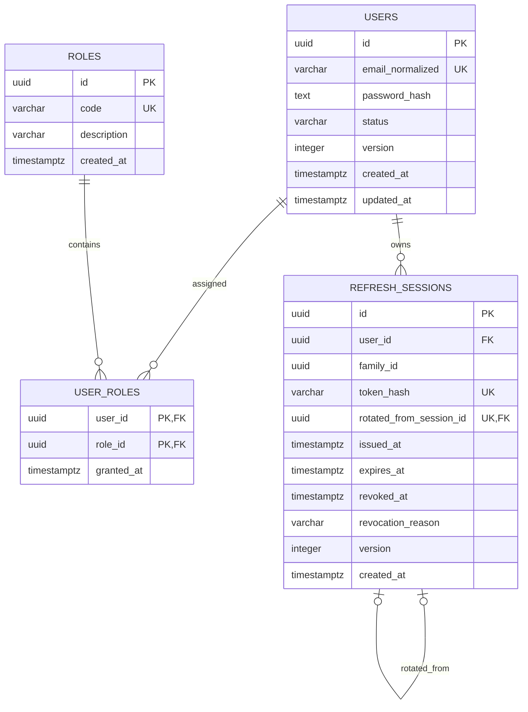

# Design Note — TKT-W04-D02

```yaml
ticket_id: TKT-W04-D02
title: Identity & Session Data Design
capability_id: CAP-IDN-01
stage: DESIGN
status: APPROVED
effective_baseline: PC-2026.7
target_database: PostgreSQL 16
planned_implementation_adapter: TypeORM + pg
application_code_authorized: false
```

---

## 1. Mục tiêu thiết kế

Thiết kế schema dữ liệu cho Identity Service nhằm bảo vệ:

* tài khoản người dùng;
* password credential;
* role assignment;
* refresh session;
* refresh-token rotation;
* refresh-token replay detection;
* database-level email uniqueness.

Thiết kế phải bảo đảm:

1. Identity Service là owner duy nhất của dữ liệu identity.
2. Password và refresh token không bao giờ được lưu plaintext.
3. Hai request đăng ký đồng thời cùng email chỉ có một request thành công.
4. Mỗi lần refresh phải rotate token.
5. Refresh token cũ bị sử dụng lại sẽ revoke toàn bộ token family tương ứng.
6. PostgreSQL constraint là lớp bảo vệ invariant cuối cùng.
7. TypeORM không được tự định nghĩa hoặc làm yếu schema PostgreSQL đã review.

---

## 2. Scope

### 2.1 Trong scope

* ERD cho:

  * `users`;
  * `roles`;
  * `user_roles`;
  * `refresh_sessions`.
* Kiểu dữ liệu PostgreSQL.
* Primary key, foreign key, unique constraint và check constraint.
* Indexing strategy.
* Registration transaction.
* Refresh-token rotation transaction.
* Replay-detection transaction.
* Migration và seed plan.
* Retention strategy cho refresh session.
* Negative constraint test matrix.
* Expected-files manifest.

### 2.2 Ngoài scope

* NestJS module, controller, service hoặc guard.
* TypeORM entity và repository.
* Migration implementation thật.
* JWT validation tại API Gateway.
* OpenAPI cho register/login/refresh/logout.
* Rate limiting.
* Email verification và password-reset flow.
* Staff role và check-in permission.
* OAuth hoặc social login.
* Multi-factor authentication.

---

## 3. Contract traceability

| Requirement    | Thiết kế đáp ứng                                                                |
| -------------- | ------------------------------------------------------------------------------- |
| `DATA-IDN-001` | Identity Service sở hữu user, role và refresh-session data                      |
| `DATA-001`     | UUID, UTC timestamp, FK trong cùng service, DB constraints                      |
| `DATA-005`     | Index chỉ được tạo từ uniqueness, FK hoặc query workload                        |
| `DATA-008`     | Có retention và purge strategy cho expired/revoked sessions                     |
| `DATA-009`     | Thiết kế dùng PostgreSQL vocabulary, không dùng ORM decorator làm nguồn sự thật |
| `DATA-010`     | Migration PostgreSQL là schema authority                                        |
| `DATA-011`     | Constraint và concurrency phải kiểm chứng trên PostgreSQL 16 thật               |
| `SEC-001`      | Password dùng adaptive hash và per-password salt                                |
| `SEC-002`      | Refresh token được hash, rotate, revoke; reuse revokes family                   |
| `SEC-003`      | Authentication failure không tiết lộ tài khoản có tồn tại hay không             |
| `SEC-007`      | Không log password, token, cookie hoặc password/token hash                      |
| `SEC-009`      | Schema hỗ trợ session revocation và abuse investigation có giới hạn             |
| `CCR-009`      | PostgreSQL-first design, TypeORM là infrastructure adapter                      |

---

## 4. Invariants

### INV-IDN-01 — Identity ownership

Chỉ Identity Service được đọc và ghi trực tiếp các bảng:

* `users`;
* `roles`;
* `user_roles`;
* `refresh_sessions`.

Service khác chỉ giữ opaque `user_id` hoặc gọi API/event contract đã được phê duyệt.

### INV-IDN-02 — Unique email

Mỗi `email_normalized` chỉ thuộc tối đa một user.

Application có thể kiểm tra email trước khi insert để cải thiện UX, nhưng PostgreSQL `UNIQUE` constraint mới là authority cuối cùng.

### INV-IDN-03 — Credential isolation

Password hash không nằm trong:

* public user profile;
* JWT claim;
* API response;
* log;
* session record.

Password hash nằm trong `users` theo `DATA-IDN-001`, nhưng persistence adapter phải dùng
allowlisted projection để profile query và public user object không select hoặc serialize
cột này.

### INV-IDN-04 — Password protection

Password phải dùng adaptive password hashing, mặc định chọn **Argon2id**.

Encoded hash phải chứa:

* algorithm;
* salt;
* memory cost;
* time cost;
* parallelism;
* resulting hash.

Không tạo cột plaintext password hoặc cột salt riêng.

### INV-IDN-05 — Refresh-token protection

Refresh token là random value có entropy tối thiểu 256 bit.

Database chỉ lưu:

```text
SHA-256(refresh_token)
```

Database không lưu refresh token gốc.

### INV-IDN-06 — Rotation

Một refresh session đã được rotate không thể tiếp tục tạo session mới hợp lệ.

Mỗi session cũ có tối đa một successor.

### INV-IDN-07 — Replay detection

Khi một refresh token đã rotate hoặc revoke được gửi lại:

1. xác định `family_id`;
2. revoke tất cả active sessions trong family đó;
3. trả authentication failure;
4. không cấp access token hoặc refresh token mới.

Các session thuộc family khác của cùng user không bị revoke.

### INV-IDN-08 — Disabled user

User có trạng thái `DISABLED` không được đăng nhập hoặc refresh.

Khi disable user, tất cả active refresh sessions của user phải được revoke trong cùng transaction.

### INV-IDN-09 — Role assignment uniqueness

Một user không thể được gán cùng role nhiều hơn một lần.

### INV-IDN-10 — PostgreSQL authority

TypeORM mapping phải phản ánh schema này. Không được sử dụng:

```typescript
synchronize: true
```

để tạo hoặc thay đổi project database.

---

## 5. Design decisions

### 5.1 Giữ `password_hash` trong `users`

`DATA-IDN-001` quy định physical shape rút gọn
`users(id,email_normalized UNIQUE,password_hash,status)`. Thiết kế giữ cột
`password_hash` trong `users`; review thiết kế không tự thay đổi contract hiệu lực.

Credential isolation được thực hiện tại application/persistence boundary:

* profile lookup dùng allowlisted columns và không select `password_hash`;
* public user domain object/DTO không có trường `password_hash`;
* authentication lookup là đường đọc riêng, có phạm vi tối thiểu;
* log, error, JWT và test snapshot không chứa password hash.

Tách credential thành bảng riêng chỉ được xem xét lại qua CCR nếu physical contract thay đổi.

### 5.2 Không sử dụng PostgreSQL `citext`

Email uniqueness dùng cột `email_normalized` rõ ràng thay vì extension `citext`.

Normalization được thực hiện trước transaction:

```text
trim → lowercase → validate length/format
```

PostgreSQL vẫn chịu trách nhiệm enforce uniqueness.

### 5.3 Một row cho mỗi refresh token được phát hành

Refresh session không được update token hash tại chỗ.

Mỗi lần rotate:

* session cũ được revoke với reason `ROTATED`;
* session mới được insert;
* session mới tham chiếu session cũ qua `rotated_from_session_id`.

Thiết kế này giữ được lịch sử cần thiết để phát hiện replay.

### 5.4 Session status được suy ra

Không lưu cột `status` trùng lặp.

```text
ACTIVE:
  revoked_at IS NULL
  AND expires_at > current_time

EXPIRED:
  revoked_at IS NULL
  AND expires_at <= current_time

REVOKED:
  revoked_at IS NOT NULL
```

Điều này tránh drift giữa `status`, `expires_at` và `revoked_at`.

### 5.5 PostgreSQL text + CHECK thay PostgreSQL ENUM

Các trạng thái dùng `varchar` kết hợp `CHECK`.

Lý do:

* migration thêm trạng thái dễ hơn PostgreSQL ENUM;
* trạng thái vẫn được database kiểm soát;
* phù hợp additive migration strategy.

---

## 6. ERD



---

## 7. Table definitions

## 7.1 `users`

Identity account và account lifecycle.

| Column             | PostgreSQL type | Null | Constraint                    |
| ------------------ | --------------- | ---: | ----------------------------- |
| `id`               | `uuid`          |   No | Primary key                   |
| `email_normalized` | `varchar(254)`  |   No | Unique                        |
| `password_hash`    | `text`          |   No | Adaptive encoded hash         |
| `status`           | `varchar(20)`   |   No | `ACTIVE` hoặc `DISABLED`      |
| `version`          | `integer`       |   No | Default `1`, greater than `0` |
| `created_at`       | `timestamptz`   |   No | UTC timestamp                 |
| `updated_at`       | `timestamptz`   |   No | UTC timestamp                 |

Constraints:

```text
pk_users
uq_users_email_normalized
ck_users_email_not_blank
ck_users_password_hash_format
ck_users_status
ck_users_version_positive
```

Không tạo index riêng cho `status` ở MVP vì:

* cardinality thấp;
* chưa có workload query user hàng loạt theo status;
* login chủ yếu lookup qua unique email.

Password hash guard:

```text
password_hash begins with "$argon2id$"
or an explicitly approved migration-compatible hash prefix
```

Database prefix check chỉ là defense-in-depth. Nó không chứng minh password đã được hash đúng; password hashing vẫn phải được kiểm tra bằng application/security tests.

---

## 7.2 `roles`

Danh sách role do hệ thống quản lý.

| Column        | PostgreSQL type | Null | Constraint    |
| ------------- | --------------- | ---: | ------------- |
| `id`          | `uuid`          |   No | Primary key   |
| `code`        | `varchar(50)`   |   No | Unique        |
| `description` | `varchar(255)`  |  Yes | —             |
| `created_at`  | `timestamptz`   |   No | UTC timestamp |

MVP role seed:

```text
CUSTOMER
ADMIN
```

Không seed:

```text
GUEST
STAFF
SERVICE
OPERATOR
```

Giải thích:

* `GUEST` là unauthenticated actor, không phải persisted user role.
* `STAFF` đang post-MVP.
* `SERVICE` sử dụng service identity riêng.
* `OPERATOR` không được cấp business permission ngầm.

---

## 7.3 `user_roles`

Many-to-many assignment giữa user và role.

| Column       | PostgreSQL type | Null | Constraint      |
| ------------ | --------------- | ---: | --------------- |
| `user_id`    | `uuid`          |   No | FK → `users.id` |
| `role_id`    | `uuid`          |   No | FK → `roles.id` |
| `granted_at` | `timestamptz`   |   No | UTC timestamp   |

Primary key:

```text
PRIMARY KEY (user_id, role_id)
```

Foreign-key policy:

```text
user_id → users.id ON DELETE CASCADE
role_id → roles.id ON DELETE RESTRICT
```

Additional index:

```text
idx_user_roles_role_user (role_id, user_id)
```

Composite primary key đã hỗ trợ lookup role theo `user_id`. Index bổ sung hỗ trợ lookup user theo `role_id`.

---

## 7.4 `refresh_sessions`

Một row đại diện cho một refresh token đã được phát hành.

| Column                    | PostgreSQL type | Null | Constraint                    |
| ------------------------- | --------------- | ---: | ----------------------------- |
| `id`                      | `uuid`          |   No | Primary key                   |
| `user_id`                 | `uuid`          |   No | FK → `users.id`               |
| `family_id`               | `uuid`          |   No | Token-family identifier       |
| `token_hash`              | `varchar(64)`   |   No | Unique SHA-256 hex digest     |
| `rotated_from_session_id` | `uuid`          |  Yes | Unique self-reference         |
| `issued_at`               | `timestamptz`   |   No | UTC timestamp                 |
| `expires_at`              | `timestamptz`   |   No | Must be after `issued_at`     |
| `revoked_at`              | `timestamptz`   |  Yes | Must not precede `issued_at`  |
| `revocation_reason`       | `varchar(30)`   |  Yes | Required when revoked         |
| `version`                 | `integer`       |   No | Default `1`, greater than `0` |
| `created_at`              | `timestamptz`   |   No | UTC timestamp                 |

Allowed revocation reasons:

```text
ROTATED
LOGOUT
REUSE_DETECTED
USER_DISABLED
ADMIN_REVOKED
```

Constraints:

```text
pk_refresh_sessions

uq_refresh_sessions_token_hash

uq_refresh_sessions_rotated_from
-- Một refresh token cũ chỉ sinh tối đa một successor.

fk_refresh_sessions_user

fk_refresh_sessions_rotated_from

ck_refresh_sessions_token_hash_format
-- ^[0-9a-f]{64}$

ck_refresh_sessions_expiry
-- expires_at > issued_at

ck_refresh_sessions_revoked_time
-- revoked_at IS NULL OR revoked_at >= issued_at

ck_refresh_sessions_revocation_pair
-- revoked_at và revocation_reason cùng NULL hoặc cùng non-NULL

ck_refresh_sessions_version_positive
```

---

## 8. Indexing strategy

| Index                                                                            | Mục đích                                     |
| -------------------------------------------------------------------------------- | -------------------------------------------- |
| `uq_users_email_normalized`                                                      | Enforce unique email và login lookup         |
| `uq_roles_code`                                                                  | Stable role lookup                           |
| `pk_user_roles(user_id, role_id)`                                                | User → roles                                 |
| `idx_user_roles_role_user(role_id, user_id)`                                     | Role → users                                 |
| `uq_refresh_sessions_token_hash`                                                 | Refresh-token lookup và duplicate protection |
| `uq_refresh_sessions_rotated_from`                                               | Một old session có tối đa một successor      |
| `idx_refresh_sessions_user_active(user_id, expires_at) WHERE revoked_at IS NULL` | Liệt kê/revoke active sessions của user      |
| `idx_refresh_sessions_family_active(family_id) WHERE revoked_at IS NULL`         | Atomic family revocation                     |
| `idx_refresh_sessions_expires_at(expires_at)`                                    | Expired-session purge                        |
| `idx_refresh_sessions_revoked_at(revoked_at) WHERE revoked_at IS NOT NULL`       | Revoked-session purge                        |

Không tạo index trên mọi foreign key theo phản xạ. Mỗi index trên được liên kết với một query hoặc invariant cụ thể.

Performance chưa được tuyên bố ở ticket này. Mọi performance claim sau này phải có `EXPLAIN (ANALYZE, BUFFERS)` trên dataset đại diện.

---

## 9. Transaction design

## 9.1 Register user

Password hashing được thực hiện **trước khi mở database transaction**, tránh giữ transaction trong lúc Argon2id đang chạy.

```text
1. Validate và normalize email.
2. Hash password bằng Argon2id.
3. BEGIN.
4. INSERT users với encoded password hash.
5. Lookup CUSTOMER role.
6. INSERT user_roles.
7. COMMIT.
```

Failure:

```text
uq_users_email_normalized violation
→ SQLSTATE 23505
→ rollback
→ application mapping: 409 Conflict
```

Application pre-check như `SELECT user WHERE email = ?` không thể thay thế unique constraint vì hai request có thể cùng vượt qua pre-check.

---

## 9.2 Login and create session family

```text
1. Lookup user bằng email_normalized.
2. Nếu không tìm thấy, vẫn thực hiện response path có timing hợp lý.
3. Verify adaptive password hash.
4. Kiểm tra users.status = ACTIVE.
5. Sinh refresh token ngẫu nhiên 256 bit.
6. Tính SHA-256 token hash.
7. Sinh family_id mới.
8. INSERT refresh_sessions.
9. Chỉ gửi token gốc cho client; không log token.
```

Mỗi login độc lập tạo một `family_id` mới. Vì vậy replay ở một thiết bị không mặc định logout các thiết bị thuộc family khác.

---

## 9.3 Rotate refresh token

Incoming token được hash trước khi query database.

Transaction:

```text
BEGIN;

SELECT *
FROM refresh_sessions
WHERE token_hash = :incoming_hash
FOR UPDATE;
```

### Trường hợp session hợp lệ

Điều kiện:

```text
revoked_at IS NULL
AND expires_at > now()
AND user.status = ACTIVE
```

Actions:

```text
1. Sinh token mới và hash mới.
2. UPDATE old session:
   revoked_at = now()
   revocation_reason = ROTATED
   version = version + 1
3. INSERT new session:
   family_id = old.family_id
   rotated_from_session_id = old.id
   token_hash = new_hash
4. COMMIT.
5. Trả access token và refresh token mới.
```

`SELECT ... FOR UPDATE` cùng unique constraint trên `rotated_from_session_id` bảo vệ concurrent rotation.

### Trường hợp token đã revoke

```text
UPDATE refresh_sessions
SET revoked_at = COALESCE(revoked_at, now()),
    revocation_reason =
      CASE
        WHEN revocation_reason = 'REUSE_DETECTED'
          THEN revocation_reason
        ELSE 'REUSE_DETECTED'
      END,
    version = version + 1
WHERE family_id = :family_id
  AND revoked_at IS NULL;

COMMIT;
Return authentication failure.
```

Không cấp token mới.

### Trường hợp token hết hạn

Không rotate. Request bị từ chối.

Session có thể được giữ lại đến khi retention job purge.

---

## 9.4 Concurrent refresh behavior

Hai request đồng thời sử dụng cùng token:

```text
Request A:
  lock row
  rotate thành công
  commit

Request B:
  chờ lock
  đọc lại row đã có revoked_at
  xác định token reuse
  revoke family
  authentication failure
```

Đây là strict replay policy theo contract.

Trade-off: một retry hợp lệ do client/network gửi request trùng cũng có thể làm family bị revoke. Grace-window hoặc retry-idempotency có thể giảm false positive nhưng không được thêm ngầm vì contract hiện yêu cầu reuse revokes family.

---

## 9.5 Disable user

```text
BEGIN;

UPDATE users
SET status = 'DISABLED',
    version = version + 1,
    updated_at = now()
WHERE id = :user_id;

UPDATE refresh_sessions
SET revoked_at = now(),
    revocation_reason = 'USER_DISABLED',
    version = version + 1
WHERE user_id = :user_id
  AND revoked_at IS NULL;

COMMIT;
```

User status và session revocation không được tách thành hai transaction độc lập.

---

## 10. Password hashing design

Default algorithm:

```text
Argon2id
```

Nguyên tắc:

* salt được thư viện sinh riêng cho mỗi password;
* encoded hash lưu cả algorithm và parameters;
* không encrypt password;
* không dùng SHA-256 cho password;
* không dùng Base64 như một cơ chế bảo vệ;
* khi parameters được nâng cấp, login thành công có thể trigger rehash;
* password comparison phải sử dụng approved password-hashing library.

Password hash không được:

* đưa vào DTO;
* đưa vào JWT;
* ghi vào log;
* ghi vào test snapshot;
* đưa vào error response.

---

## 11. Refresh-token hashing design

Refresh token phải là random value có entropy cao, không phải user-created secret.

Storage:

```text
token_hash = hex(SHA-256(refresh_token))
```

Lý do sử dụng fast hash:

* refresh token có entropy tối thiểu 256 bit;
* attacker không thể dictionary-guess như password thông thường;
* lookup theo deterministic hash là cần thiết;
* adaptive password hash sẽ làm session lookup không thực tế.

Điều kiện an toàn này không còn đúng nếu refresh token ngắn, có cấu trúc dự đoán được hoặc lấy từ user input.

---

## 12. Retention and purge strategy

Proposed reviewed duration:

```text
Expired hoặc revoked refresh sessions:
retain 30 days, sau đó hard delete.
```

Mục đích:

* hỗ trợ replay investigation trong khoảng thời gian giới hạn;
* tránh lưu session history vô thời hạn;
* đáp ứng data-minimization.

Purge conditions:

```text
revoked_at IS NOT NULL
AND revoked_at < now() - interval '30 days'
```

hoặc:

```text
revoked_at IS NULL
AND expires_at < now() - interval '30 days'
```

Purge job:

* chạy theo batch có giới hạn;
* không giữ transaction dài;
* không log token hash;
* ghi metric dạng bounded count;
* có retry bounded;
* không làm ảnh hưởng active sessions.

Duration 30 ngày là design decision và phải được reviewer chấp thuận trước readiness.

---

## 13. Migration plan

## 13.1 Clean path

Trên PostgreSQL 16 database sạch:

```text
1. Create users.
2. Create roles.
3. Create user_roles.
4. Create refresh_sessions.
5. Add constraints.
6. Add indexes.
7. Run role seed.
8. Execute positive and negative database tests.
```

## 13.2 Upgrade path

Previous application baseline chưa có Identity application schema.

Migration phải:

* chỉ thêm object mới;
* không phụ thuộc `synchronize`;
* không xóa hoặc rename object không liên quan;
* chạy thành công trên previous baseline;
* chạy đúng một lần;
* thất bại rõ ràng nếu schema drift.

## 13.3 Rollback/forward-fix

Trước production, migration có thể được kiểm tra bằng reverse-order cleanup trên test database:

```text
refresh_sessions
→ user_roles
→ roles
→ users
```

Sau khi migration đã được deploy vào shared/production environment:

* không rewrite migration;
* không sửa migration cũ;
* ưu tiên forward-fix migration;
* destructive rollback phải có data-loss review riêng.

---

## 14. Seed plan

Chỉ seed stable reference data:

```text
CUSTOMER
ADMIN
```

Seed requirements:

* deterministic UUID hoặc stable code;
* idempotent;
* dùng `ON CONFLICT (code)` an toàn;
* không tạo user thật;
* không seed password;
* không seed refresh token;
* không chứa production email hoặc PII;
* không tự gán ADMIN cho user đăng ký public.

Public registration chỉ được gán `CUSTOMER`.

---

## 15. Negative constraint matrix

| Case                                       | Database protection                    | Expected observation                                |
| ------------------------------------------ | -------------------------------------- | --------------------------------------------------- |
| Hai user cùng `email_normalized`           | `uq_users_email_normalized`            | Một success, một `SQLSTATE 23505`                   |
| Email rỗng                                 | `ck_users_email_not_blank`             | `SQLSTATE 23514`                                    |
| User status không hợp lệ                   | `ck_users_status`                      | `SQLSTATE 23514`                                    |
| Password hash không đúng prefix cho phép   | `ck_users_password_hash_format`        | `SQLSTATE 23514`                                    |
| Cùng role gán hai lần                      | PK `(user_id, role_id)`                | `SQLSTATE 23505`                                    |
| Role assignment dùng role không tồn tại    | FK                                     | `SQLSTATE 23503`                                    |
| Token hash trùng                           | `uq_refresh_sessions_token_hash`       | `SQLSTATE 23505`                                    |
| Token hash không phải 64 hex chars         | Hash-format check                      | `SQLSTATE 23514`                                    |
| `expires_at <= issued_at`                  | Expiry check                           | `SQLSTATE 23514`                                    |
| `revoked_at < issued_at`                   | Revoked-time check                     | `SQLSTATE 23514`                                    |
| `revoked_at` có nhưng reason NULL          | Revocation-pair check                  | `SQLSTATE 23514`                                    |
| Hai successor cùng old session             | `uq_refresh_sessions_rotated_from`     | Một success, một `23505` hoặc bị xử lý qua row lock |
| Refresh token đã rotate được dùng lại      | Rotation history                       | Toàn bộ active family bị revoke                     |
| Disabled user refresh                      | User-status check + transaction policy | Không cấp token mới                                 |
| Plaintext refresh token xuất hiện trong DB | Security integration test              | Test fail; database chỉ có hash                     |
| Password/hash xuất hiện trong profile, JWT hoặc log | Security integration test       | Test fail                                           |

---

## 16. Test strategy

### 16.1 Schema tests

Chạy trên PostgreSQL 16 thật:

* clean migration;
* migration từ previous baseline;
* all PK/FK/UNIQUE/CHECK constraints;
* seed chạy hai lần không tạo duplicate;
* schema không chứa plaintext password/token columns.

### 16.2 Transaction tests

* registration rollback khi role assignment thất bại;
* disable user và revoke sessions atomic;
* refresh rotation update + insert atomic;
* rollback không để old session revoked nhưng new session chưa tồn tại.

### 16.3 Concurrency tests

Dùng hai database connections thật:

1. Hai registration đồng thời cùng normalized email.
2. Hai refresh request đồng thời dùng cùng token.
3. Hai transaction cố tạo successor từ cùng old session.
4. Family revocation chạy trong khi một refresh đang chờ row lock.

### 16.4 Security tests

* password hash có approved algorithm prefix;
* refresh token hash đúng SHA-256 digest;
* raw token không xuất hiện trong DB dump kiểm thử;
* log fixture không chứa password, refresh token hoặc hash;
* generic authentication error không phân biệt:

  * email không tồn tại;
  * password sai;
  * session không hợp lệ.

### 16.5 ORM boundary tests ở implementation ticket

TypeORM tests sau này phải chứng minh:

* `synchronize` bị disable;
* mapping đúng PostgreSQL column types;
* TypeORM migration tạo đúng constraints/indexes;
* domain/application layer không import TypeORM;
* database integration tests không bị thay thế bằng repository mock.

---

## 17. Failure mapping proposal

Đây chỉ là data-layer mapping proposal; API contract cuối cùng thuộc ticket sau.

| Database/domain result                           | Proposed public result                                  |
| ------------------------------------------------ | ------------------------------------------------------- |
| Duplicate normalized email                       | `409 Conflict`                                          |
| Invalid login credential                         | `401 Unauthorized` generic                              |
| Unknown refresh token                            | `401 Unauthorized` generic                              |
| Expired refresh token                            | `401 Unauthorized` generic                              |
| Revoked/replayed refresh token                   | `401 Unauthorized`; revoke family                       |
| Disabled user                                    | `401 Unauthorized` generic                              |
| Internal FK/check violation do programming error | Safe `500`; không expose SQL                            |
| Database timeout                                 | Safe service error; không retry unsafe transaction ngầm |

SQL constraint name và SQL detail không được trả trực tiếp cho client.

---

## 18. Rejected alternatives

### Alternative A — Tách `password_hash` sang `user_credentials`

**Rejected.**

Lý do:

* `DATA-IDN-001` đặt `password_hash` trong `users`;
* Design Review không có quyền thay đổi physical contract;
* thay đổi này cần approved CCR và đánh giá migration/compatibility impact.

### Alternative B — Update token hash trên cùng session row khi rotate

**Rejected.**

Lý do:

* mất hash của token cũ;
* không thể phân biệt unknown token với replay token;
* không giữ được rotation chain;
* family reuse detection kém tin cậy.

### Alternative C — Lưu plaintext refresh token để lookup

**Rejected.**

Lý do:

* database leak trở thành active session compromise;
* vi phạm `SEC-002`;
* không cần thiết vì deterministic SHA-256 lookup đáp ứng yêu cầu.

### Alternative D — Thiết kế schema bằng TypeORM decorator trước

**Rejected.**

Lý do:

* ORM metadata không phải schema authority;
* có thể bỏ sót PostgreSQL constraint/index/concurrency behavior;
* vi phạm PostgreSQL-first baseline.

### Alternative E — Dùng application pre-check thay unique constraint

**Rejected.**

Lý do:

* tồn tại race window;
* hai transaction có thể cùng đọc “email chưa tồn tại”;
* invariant không được bảo vệ tại source of truth.

---

## 19. Trade-offs and limitations

### Trade-offs

* Giữ credential trong `users` giảm một join khi login nhưng bắt buộc persistence projection
  và serialization allowlist chặt để tránh credential exposure.
* Một row cho mỗi token rotation làm bảng session lớn hơn nhưng cho phép replay detection.
* Strict family revocation tăng an toàn nhưng có thể revoke session khi client gửi duplicate refresh request.
* Explicit email normalization cần application policy nhất quán nhưng không phụ thuộc database extension.
* Database constraints tăng write validation cost nhưng bảo vệ invariant dưới concurrency.

### Limitations

* Thiết kế chưa định nghĩa access-token claims.
* Chưa định nghĩa refresh cookie attributes.
* Chưa định nghĩa rate-limit implementation.
* Chưa xử lý password reset hoặc email verification.
* Chưa chứng minh performance.
* Chưa có runtime evidence vì application chưa được scaffold.
* Prefix check không tự chứng minh password được hash an toàn.
* Hash-format check không tự chứng minh refresh token gốc có đủ entropy.

---

## 20. Acceptance criteria mapping

### AC-W04-D02-1 — Owner/invariants mapped

Đạt ở mức design khi reviewer xác nhận:

* Identity Service là sole owner;
* toàn bộ tables và trust boundaries được map;
* credential/session access boundary rõ ràng dù credential cùng physical table với user;
* rotation và replay invariants không mâu thuẫn.

### AC-W04-D02-2 — Clean and upgrade plan

Đạt ở mức design khi reviewer xác nhận:

* clean migration order;
* upgrade từ previous baseline;
* idempotent role seed;
* rollback/forward-fix policy;
* PostgreSQL 16 real-engine verification plan.

### AC-W04-D02-3 — Negative constraint matrix

Đạt ở mức design khi reviewer xác nhận:

* duplicate email;
* duplicate role;
* invalid FK/check;
* duplicate token hash;
* concurrent rotation;
* replay detection;
* plaintext-secret negative tests.

---

## 21. Expected files

Proposed artifacts:

```text
AI-contracts/designs/
└── 2026-07-28-tkt-w04-d02-design.md

AI-contracts/expected-files/
└── 2026-07-28-tkt-w04-d02-expected-files.yml

AI-contracts/readiness/
└── 2026-07-28-tkt-w04-d02-readiness.yml
```

Expected implementation files sau khi readiness được phê duyệt chỉ là projection, không phải authorization tạo file:

> **Topology clarification (2026-07-30):** reviewer đã chốt topology triển khai tại
> D05: root `client/` dành cho frontend, còn `apps/` là backend workspace và chứa
> `identity-service/` trực tiếp. Cây projection bên dưới đã được sửa theo topology này;
> quyết định dữ liệu D02 không thay đổi.

```text
apps/
└── identity-service/
    ├── src/
    │   ├── domain/
    │   ├── application/
    │   ├── infrastructure/
    │   │   └── persistence/
    │   │       └── typeorm/
    │   └── presentation/
    └── migrations/
```

Tên module thực tế phải được xác nhận từ repository scaffold ticket; không được xem các path trên là file đã tồn tại.

---

## 22. Review decisions required

Reviewer cần quyết định rõ:

1. Chấp thuận giữ `password_hash` trong `users` để tuân thủ physical shape của `DATA-IDN-001`.
2. Chấp thuận Argon2id làm password-hashing default.
3. Chấp thuận strict replay policy không có grace window.
4. Chấp thuận mỗi login tạo token family riêng.
5. Chấp thuận retention period 30 ngày.
6. Chấp thuận seed chỉ gồm `CUSTOMER` và `ADMIN`.
7. Chấp thuận PostgreSQL text + CHECK thay PostgreSQL ENUM.
8. Chấp thuận không sử dụng `citext`.

```yaml
unanswered_requirement_conflicts: 0
design_decisions_awaiting_review: 0
readiness_authorized: true
implementation_authorized: false
```

---

## 23. Review verdict placeholder

```yaml
review_status: APPROVED
reviewer: Codex
reviewed_at: "2026-07-28"
blocking_findings: []
required_remediation: []
next_stage_if_approved: READINESS
```

Approval của Design Note chỉ cho phép chuyển sang Readiness Review.

Nó không tự cho phép:

* scaffold application;
* tạo TypeORM entity;
* tạo migration;
* cài dependency;
* triển khai register/login/refresh.
