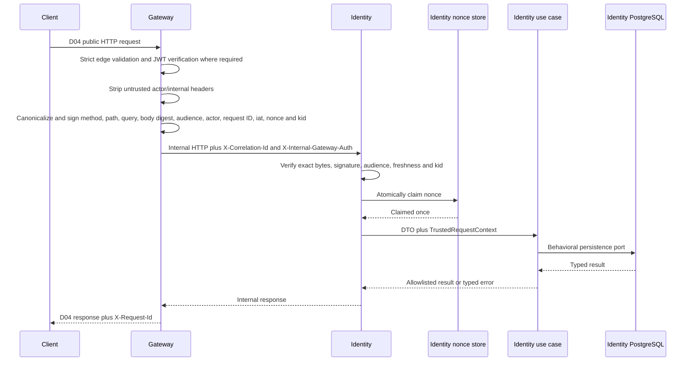

# Design Note — TKT-W04-D05 Identity Vertical Slice

## Status and authority

- **Status:** `APPROVED`
- **Ticket:** `TKT-W04-D05`
- **Effective baseline:** `PC-2026.8`
- **Capabilities:** `CAP-IDN-01`, `CAP-SEC-01`
- **Prerequisites:** `TKT-W04-D01` through `TKT-W04-D04` are `VERIFIED`
- **Learning gate:** `LG-TKT-W04-D05 PASSED` at `C4_DEFEND`
- **Analysis input:**
  `AI-contracts/audits/2026-07-30-tkt-w04-d05-analysis.md`
- **Reviewed contract inputs:**
  - D02 Identity data design
  - D03 token lifecycle and authenticated Gateway-to-Identity request design
  - D04 OpenAPI, error, idempotency and contract-test design
- **Design discussion:** the reviewer approved each proposed decision group on
  `2026-07-30`. The reviewer then corrected the repository topology so `client/` is the
  root frontend boundary and `apps/` is the backend workspace, with no intermediate
  `server/` directory. The reviewer approved the corrected assembled note and
  expected-files manifest on `2026-07-30`.
- **Implementation finding `EF-D05-001` (2026-07-31):** npm accepted the root
  `workspaces` patterns, but `npm query .workspace` returned an empty list because the
  four child packages had no package markers. Reviewer approved the simpler resolution:
  `apps/` is one NestJS package/lockfile authority, while Gateway, Identity and shared
  libraries remain Nest projects rather than independent npm packages.

## Outcome, scope and non-scope

The deliverable is the first runnable NestJS vertical slice for register, login,
refresh, logout and `/me` through the public Gateway, authenticated internal Identity
boundary and Identity-owned PostgreSQL 16 data. It must provide reproducible evidence
at domain, application, database, contract and real multi-service boundaries.

The slice does not implement Catalog, Booking, Payment, Worker, frontend, OAuth,
password recovery, email verification, MFA, Staff capabilities, production deployment
or routes absent from the reviewed D04 OpenAPI document.

## Decision 1 — repository and NestJS topology

The repository root separates the future frontend from the backend workspace:

```text
MovieTicketBookingApp/
├── client/                         future frontend; untouched by D05
└── apps/                           backend workspace
    ├── AGENTS.md
    ├── package.json
    ├── package-lock.json
    ├── nest-cli.json
    ├── tsconfig.json
    ├── tsconfig.build.json
    ├── eslint.config.mjs
    ├── .prettierrc.json
    ├── docker-compose.test.yml
    ├── api-gateway/
    │   ├── AGENTS.md
    │   ├── src/
    │   │   ├── application/
    │   │   ├── infrastructure/
    │   │   ├── transport/
    │   │   └── bootstrap/
    │   └── test/
    │       ├── integration/
    │       └── e2e/
    ├── identity-service/
    │   ├── AGENTS.md
    │   ├── src/
    │   │   ├── domain/
    │   │   ├── application/
    │   │   ├── infrastructure/
    │   │   ├── transport/
    │   │   └── bootstrap/
    │   ├── migrations/
    │   ├── seeds/
    │   └── test/
    │       ├── unit/
    │       ├── integration/
    │       ├── contract/
    │       └── e2e/
    └── libs/
        ├── auth-contract/
        └── observability/
```

The backend workspace at `apps/` owns one npm lockfile. The root `client/` directory is
not made a package before a frontend ticket authorizes it. The repository-root
`package.json` remains documentation/control-plane tooling and does not become the
backend dependency authority. Gateway has no synthetic domain layer:
its responsibilities are transport, edge authentication, trusted-context construction,
internal request signing and Identity client orchestration. Identity owns the auth
domain and persistence.

Shared libraries contain only versioned transport contracts and telemetry primitives.
They must not contain domain entities, TypeORM entities, repositories, use cases or
shared database access.

`apps/` is intentionally a single-package NestJS monorepo. Gateway, Identity and shared
libraries are independently buildable Nest/TypeScript projects, but they do not declare
independent npm package metadata or dependency versions in D05. Reconsider npm
workspaces only when independent dependency, publication, CI graph or packaging
lifecycle becomes an observed requirement.

## Decision 2 — dependency direction and composition

The allowed direction is:

```text
transport → application → domain
infrastructure → application ports
bootstrap → transport + application + infrastructure
```

- Domain is framework-free and does not import NestJS, TypeORM, HTTP, environment
  configuration or provider SDKs.
- Application defines behavioral ports and typed application errors. It does not import
  controllers, ORM entities, repositories, `EntityManager` or `QueryRunner`.
- Transport performs DTO/header parsing and maps typed results to the D04 HTTP contract.
- Infrastructure implements application ports for PostgreSQL, Argon2id, JWT, encryption,
  randomness, clocks and internal HTTP/signature behavior.
- Bootstrap is the only composition root that selects concrete adapters and configuration.
- Gateway calls Identity only through `IdentityAuthClientPort` and an authenticated HTTP
  adapter. Gateway cannot import private Identity source or connect to its database.

Static architecture tests enforce these directions. Nested `AGENTS.md` files record
module-specific commands and dependency rules after the corresponding real modules and
tooling are created.

## Decision 3 — runtime and tooling baseline

- NestJS with the Fastify adapter and strict TypeScript.
- One npm package and lockfile for the NestJS backend projects under `apps/`.
- PostgreSQL 16 and TypeORM infrastructure adapters.
- Immutable migrations with `synchronize: false`; `synchronize: true` is forbidden.
- Argon2id for passwords.
- Opaque cryptographically random refresh tokens stored only as hashes.
- Asymmetric JWT signing and verification with versioned `kid`.
- Keyed HMAC-SHA-256 for registration fingerprints.
- Authenticated internal Gateway requests using the reviewed D03 canonical input.
- Jest plus Fastify injection/Supertest-equivalent HTTP assertions.
- ESLint and Prettier at the backend workspace root.

Secrets and private keys are loaded through validated runtime configuration. Example
configuration may name variables but must not contain working credentials or private
keys.

## Decision 4 — public and internal request flow



Identity verifies internal authentication and claims the nonce before controller or use
case invocation. Missing authentication, invalid signature, wrong audience, expired
freshness window, unknown `kid`, body/path/method tampering, nonce replay or nonce-store
failure fails closed with no business side effect.

### Implementation clarification — trusted application invocation

The Identity transport invokes authenticated internal application operations as
`execute(command, context)`. Each command contains only its D04 operation fields;
`TrustedRequestContext` is a separate, required invocation parameter. Keeping request
metadata outside commands prevents actor, correlation and signature-derived values from
becoming registration fingerprint or credential inputs while still carrying verified
context across the transport-to-application boundary. The application model owns the
framework-free invocation-context shape, and transport maps the structurally compatible
internal-auth context into it. Public registration and login do not authorize from an
actor, but they still receive context for correlation and future application-boundary
audit hooks; no use case reconstructs context from request body fields.

Public auth requests without a user actor are still signed as Gateway service context
with an explicitly empty actor. `/me` carries only actor claims derived from the verified
access token. Internal correlation uses `X-Correlation-Id`; public correlation uses
`X-Request-Id`, and `error.requestId` uses the same trusted identifier.

Configuration defaults:

- internal freshness: 30 seconds;
- accepted clock skew: 5 seconds;
- nonce retention: 5 minutes.

All remain bounded configuration and are not silently changed into public API constants.

## Decision 5 — Identity-owned operation-security tables

### Registration idempotency

`registration_idempotency_records` stores completed outcomes only; durable
`IN_PROGRESS` is not a state authority.

| Column                      | Purpose                                                               |
| --------------------------- | --------------------------------------------------------------------- |
| `id` UUID primary key       | Stable record identity                                                |
| `operation`                 | Bounded operation name                                                |
| `key_hash`                  | SHA-256 of the opaque idempotency key                                 |
| `fingerprint_hash`          | Keyed HMAC-SHA-256 over the canonical request plus fingerprint key ID |
| `fingerprint_key_id`        | Fingerprint-key rotation identifier                                   |
| `user_id`                   | Local FK to the created user                                          |
| `encrypted_response`        | Authenticated encrypted logical response needed for exact replay      |
| `response_key_id` and nonce | Response-encryption key version and nonce                             |
| `created_at`, `expires_at`  | UTC retention boundary                                                |

The table has a unique constraint on `(operation, key_hash)`, a local user FK and an
expiry index. It intentionally has no index on low-cardinality status because no status
column is introduced. Default retention is configurable at 24 hours.

The keyed fingerprint prevents a leaked database from becoming an offline password
guessing oracle. Response encryption is prepared before the database transaction and
keeps exact logical replay possible without storing plaintext credentials.

### Internal request nonce claims

`internal_request_nonces` has primary key `(audience, nonce_hash)` plus request UUID,
signing key ID, issued/claimed/expiry timestamps and an expiry index. The nonce is stored
as SHA-256, not plaintext.

Claiming uses one atomic insert:

```sql
INSERT ... ON CONFLICT DO NOTHING RETURNING ...
```

No returned row means replay. Store failure fails closed. Cleanup is retention work and
does not weaken claim-before-use behavior. Gateway never accesses either Identity table.

## Decision 6 — transaction boundaries and behavioral ports

Crypto preparation occurs outside database transactions where correctness permits it.
Transactions contain no network call. Application ports expose atomic behavior instead
of leaking primitive repository operations.

### Register

1. Canonicalize approved fields; do not normalize password bytes.
2. Compute idempotency key hash and keyed request fingerprint.
3. Read a completed replay outcome if it exists.
4. Perform an optional non-authoritative canonical-email precheck.
5. Hash the password and generate refresh/session material.
6. Encrypt the replay outcome.
7. Call `RegistrationPersistencePort.registerAtomically`.
8. In one transaction insert user, Customer role assignment, refresh session and
   completed idempotency record.

The named canonical-email and idempotency constraints are concurrency authorities.
A concurrent idempotency loser rolls back, then reads the winning completed record and
compares fingerprints. Same key/same request replays the original logical outcome;
same key/different request returns `409 IDEMPOTENCY_KEY_CONFLICT`. Constraint mapping
checks the named constraint, not every PostgreSQL `23505`.

### Login

`CredentialReaderPort` retrieves the minimal credential record.
`LoginSessionPort.issueForActiveUserAtomically` locks or rechecks the user state and
persists the refresh session in one short transaction. Unknown email, wrong password
and disabled/non-authenticatable account map to the same D04
`401 INVALID_CREDENTIALS`. Access-token signing occurs after persistence commits.

### Refresh

`RefreshSessionRotationPort.rotateOrRevokeReplayAtomically` owns the complete state
transition. A preliminary token-hash lookup may find a locator, but the transaction
revalidates authoritative state.

Global lock ordering is user row first, then refresh-session rows by stable identifier.
The transaction:

- locks and rechecks the user;
- locks the presented session;
- for active/unexpired input, revokes it with reason `ROTATED` and inserts one successor
  in the same family;
- for reuse, locks family rows in stable order, revokes the family with reason `REUSE`
  and inserts no successor.

The model derives effective state from `revoked_at`, `expires_at` and revocation reason;
it does not add a conflicting status authority. Random, expired, revoked, disabled-user
and replayed credentials all map to `401 INVALID_REFRESH_TOKEN`. The successor plaintext
exists only in process memory, and the access token is signed after commit.

Concurrent use intentionally has a security-biased result: one transaction may initially
rotate successfully, while the detected reuse revokes the resulting family. Therefore
the final database state has no effective successor even though one caller may have
received a `200`.

### Logout

`LogoutSessionPort.revokeReplaySafeAtomically` uses the same lock order. Active input is
revoked with `LOGOUT`. A retained credential already revoked by `LOGOUT` returns
replay-safe `204`. Rotated/reused credentials trigger or preserve family reuse handling
and return neutral `401`. Malformed, expired or unknown credentials also return neutral
`401`.

Reasons are bounded to `ROTATED`, `LOGOUT`, `REUSE` and `DISABLED`. Plaintext tokens are
never persisted.

### `/me`

`ProfileReaderPort` returns an allowlisted customer projection for the trusted actor ID.
Password, password hash, session, token, role-assignment internals and security metadata
are never selected into the response. Missing or inconsistent trusted actor/user state
maps to the neutral D04 `401` vocabulary because D04 defines no `/me` not-found response.

## Decision 7 — DTO and error boundary

- DTOs are transport-only allowlists with global whitelist validation,
  `forbidNonWhitelisted: true` and transformation that cannot mass-assign domain state.
- Clients cannot submit role, user ID, account state, session ownership or trusted actor
  fields.
- Domain errors express invariants without HTTP status or framework types.
- Application errors express typed use-case outcomes.
- Transport uses one explicit D04 error mapper and error envelope.
- Infrastructure errors are translated at the adapter boundary; raw SQL, constraint,
  crypto, stack, key, token or provider detail never crosses the public boundary.
- Unknown infrastructure/availability and ambiguous commit outcomes map honestly to the
  reviewed availability policy; they are never reported as confirmed rollback.

Clock, UUID and cryptographic randomness are ports so deterministic tests do not replace
production cryptography.

## Decision 8 — migration, seed and rollback

Identity owns migrations for:

- users;
- roles;
- user-role associations;
- refresh sessions/families;
- registration idempotency records;
- internal request nonces.

PostgreSQL constraints implement local FKs, canonical-email uniqueness, unique
idempotency operation/key, nonce replay uniqueness and bounded check invariants. Indexes
serve canonical credential lookup, session-family operations and expiry cleanup. No
cross-service FK, shared schema or shared database credential is allowed.

Verification covers:

1. clean PostgreSQL 16 database → all migrations → seed → smoke;
2. reviewed D02-compatible checkpoint/data → D05 migrations → preserved data → smoke;
3. both paths reaching the same logical schema;
4. seed run twice with unchanged logical state;
5. non-zero failure on unexpected seed errors;
6. repository scan proving `synchronize: true` is absent.

Applied shared-environment migrations are immutable. A failed pre-deployment migration
may be rolled back only when its tested down path is lossless. After publication or
data-bearing deployment, correction uses a forward-fix migration. Application rollback
must remain compatible with the deployed schema and must never restore unsigned actor
trust, permissive DTO handling or plaintext credential storage.

## Decision 9 — verification architecture

### Unit

- domain factories and refresh-session rules;
- register/login/refresh/logout/profile use cases through controlled ports;
- neutral error mapping and idempotency decisions;
- signature canonicalization;
- DTO/error logic where behavior exists.

### PostgreSQL 16 integration

- clean and upgrade migration paths;
- named unique/check/FK constraints;
- atomic registration rollback;
- login/disable race recheck;
- refresh rotation/reuse and final family state;
- replay-safe logout;
- single-use nonce claim;
- idempotent seed.

SQLite and mocked repositories cannot substitute for this evidence.

### Contract

The live Gateway response is validated against
`AI-contracts/openapi/auth-api.v1.yaml` and the D04 matrix: methods, paths, headers,
request/response schemas, status codes, error envelope, field disclosure, JSON refresh
delivery and logout request shape.

### End to end

The harness starts Gateway, Identity and PostgreSQL and verifies:

- register → `/me` → refresh → logout;
- same-key/same-request register replay;
- same-key/different-request conflict;
- neutral login failures;
- refresh replay and family revocation;
- missing/tampered/replayed internal authentication;
- spoofed actor headers cannot change `/me` identity;
- public/internal correlation continuity.

### Deterministic concurrency

A test-only synchronization hook pauses two refresh contenders after preliminary lookup
and releases them together. It is wired only by the test composition root. Evidence
asserts response outcomes and final database state; a coincidental `Promise.all` race is
not sufficient.

### Architecture and redaction

Static dependency tests enforce the direction in Decision 2. Captured structured logs
from success and negative flows are scanned for marker passwords, access/refresh tokens,
JWTs, raw bodies, internal signatures, password hashes and sensitive fingerprint/token
hashes.

Allowed log context is request/correlation ID, service, operation, outcome, bounded
error category, duration and non-secret key version where operationally required.

## Decision 10 — evidence commands and truthfulness

The implementation phase may add backend-local commands only after the real workspace
and tools exist. The design names command responsibilities, not fabricated current
results:

- install reproducibly from the backend lockfile;
- format/lint/typecheck/build;
- unit and architecture tests;
- PostgreSQL integration and migration tests;
- contract tests;
- multi-service E2E and synchronized concurrency tests;
- captured-log redaction scan.

The evidence manifest must record prediction, exact command, working directory,
environment, exit code, observation, artifact path and limitation. Unavailable or
interrupted work is reported as `NOT_AVAILABLE`, `NOT_RUN` or `INTERRUPTED`.
Test count and coverage never replace boundary-specific proof.

## Alternatives rejected

| Alternative                                              | Rejection reason                                                                                          |
| -------------------------------------------------------- | --------------------------------------------------------------------------------------------------------- |
| One NestJS AuthService importing TypeORM, JWT and Argon2 | Hides transaction/security boundaries and violates dependency direction                                   |
| Shared Identity entity/repository library                | Breaks service ownership and enables Gateway database coupling                                            |
| TypeORM `synchronize: true`                              | Does not provide reviewed, repeatable migration evidence                                                  |
| SQLite integration evidence                              | Cannot prove PostgreSQL constraints, row locks or concurrency semantics                                   |
| Primitive repository calls composed in refresh use case  | Makes atomic rotation and family revocation splittable                                                    |
| Durable idempotency `IN_PROGRESS` row                    | Creates abandoned-state recovery complexity without being required for completed exact replay             |
| Plain SHA-256 request fingerprint                        | Enables offline guessing against password-bearing registration payloads                                   |
| Trust internal headers on a private network              | Does not authenticate Gateway or bind request integrity                                                   |
| Redis-only nonce store in D05                            | Adds another operational dependency before a measured need; PostgreSQL provides the required atomic claim |
| Mocked Gateway or injected trusted actor as E2E          | Does not exercise signing, stripping, verification or correlation boundaries                              |

## Risks, limitations and change conditions

- Strict refresh reuse handling may revoke a legitimate family after concurrent client
  requests, retries or an unknown commit outcome. Relaxation requires a reviewed security
  contract change, not an implementation shortcut.
- Encrypted idempotency outcomes create key-rotation and retention responsibility.
- PostgreSQL nonce claiming creates one write per authenticated internal request.
  A different replay store requires measured evidence and a reviewed design change.
- This first slice favors explicit files and boundaries over premature generic
  abstractions. Shared code is extracted only after a real second consumer exists.
- No production performance, deployment or zero-downtime migration claim is made.

## Expected-files boundary

The exact authorized file set is proposed in:

`AI-contracts/expected-files/2026-07-30-tkt-w04-d05-expected-files.yml`

No `apps/**` file may be created until:

1. this assembled design and manifest receive explicit reviewer approval;
2. the manifest status becomes `APPROVED`;
3. readiness is evaluated as `READY`;
4. canonical state advances to `IMPLEMENTATION`.

Any additional application path returns the ticket to `DESIGN`.

## Review checklist

- [x] Topology preserves Gateway/Identity ownership, uses `apps/` as the backend
      workspace and leaves root `client/` untouched.
- [x] Dependency rules keep NestJS and TypeORM outside domain/application policy.
- [x] Public behavior remains identical to the reviewed D04 OpenAPI.
- [x] Register, login, refresh and logout transaction boundaries are explicit.
- [x] Idempotency outcome and nonce replay stores have reviewed security/retention rules.
- [x] Migration and seed verification covers clean, upgrade and repeat execution.
- [x] Real PostgreSQL, live HTTP, multi-service, concurrency and redaction evidence are
      separated from unit claims.
- [x] Expected-files manifest names exact paths and forbids unplanned expansion.
- [x] Risks and unknown commit outcomes are reported honestly.

## Amendment DA-D05-002 — Session Credentials and expiresIn Authority

- **Date:** 2026-08-08
- **Status:** `APPROVED`
- **Reviewed by:** User / Reviewer
- **Reviewed at:** 2026-08-08
- **Approval evidence:** Explicit `duyệt` response to the requested `duyệt DA-D05-002`
- **Problem:**
  The initial D05 vertical slice draft specified `RegisterClientResult` as `{ user: IdentityUserResponse }` without session tokens or token lifetime (`expiresIn`), and left `expiresIn` unparsed in `IdentityHttpAdapter` for login/refresh. However, public OpenAPI D04 requires `POST /api/v1/auth/register`, `POST /api/v1/auth/login`, and `POST /api/v1/auth/refresh` to return `AuthSessionResponse` containing required non-optional fields: `accessToken`, `refreshToken`, `tokenType: 'Bearer'`, `expiresIn`, and `user`.

- **Decision & Authority Rules:**
  1. **Authoritative Source of `expiresIn`:** Identity Service owns authentication session creation and access-token lifetime configuration (`expiresInSeconds` derived dynamically from runtime `IdentityConfig` passed into `AuthTokenAdapter`). `AuthTokenPort` signs access tokens and returns the signed token alongside `expiresIn`. Identity Service is the single authoritative source of `expiresIn` (positive integer in seconds). Gateway controllers, proxy use cases, and HTTP adapters MUST NOT hard-code, default, or fabricate TTL values.
  2. **Non-Overlapping Token Responsibilities:**
     - `AuthTokenPort` (`auth-crypto.ports.ts` / `auth-token.adapter.ts`): Responsible for asymmetric access-token signing and returning `{ accessToken, expiresIn }`.
     - Session & Persistence Ports (`registration-persistence.port.ts`, `login-session.port.ts`, `refresh-session-rotation.port.ts`, `auth-persistence.adapter.ts`): Responsible for generating, rotating, and atomically persisting opaque refresh tokens, user accounts, and completed idempotency outcomes.
  3. **Register Creates User & Session Atomically:** `POST /internal/auth/register` creates the user, generates and persists the initial refresh session, and stores the completed encrypted idempotency outcome atomically via `RegistrationPersistencePort.registerAtomically`. `RegisterResult` returns user registration details along with session credentials (`accessToken`, `refreshToken`, `expiresIn`).
  4. **Strict Non-Optional Contract Types:**
     - `InternalRegisterResponseDto`, `InternalLoginResponseDto`, `InternalRefreshResponseDto` in Identity Service contain non-optional `accessToken: string`, `refreshToken: string`, `expiresIn: number`, `user`.
     - `RegisterClientResult`, `LoginClientResult`, `RefreshClientResult` in `identity-auth-client.port.ts` contain non-optional `accessToken: string`, `refreshToken: string`, `expiresIn: number`, `user: IdentityUserResponse`.
  5. **Adapter & Controller Propagation:** `IdentityHttpAdapter` parses `accessToken`, `refreshToken`, and `expiresIn` (asserting `typeof obj.expiresIn === 'number' && obj.expiresIn > 0`) from internal responses without fallbacks. Gateway `AuthController` maps these fields transparently to D04 `AuthSessionResponse`.
  6. **Positive-Integer Config Validation & Test Scope:** `JWT_ACCESS_TOKEN_TTL_SECONDS` in `IdentityConfig` / `identity-config.ts` must strictly parse as a positive integer (`> 0`) and fail closed on missing, zero, negative, or non-numeric values. `apps/.env.example` and `apps/identity-service/test/unit/security-adapters.spec.ts` are authorized to document and verify positive-integer TTL parsing, fail-closed invalid TTL rejection, and the `{ accessToken, expiresIn }` result shape.
  7. **Authorized Path Manifest:**
     - `apps/.env.example`
     - `apps/identity-service/src/bootstrap/identity-config.ts`
     - `apps/identity-service/src/bootstrap/identity.module.ts`
     - `apps/identity-service/src/application/ports/auth-crypto.ports.ts`
     - `apps/identity-service/src/application/ports/registration-persistence.port.ts`
     - `apps/identity-service/src/infrastructure/security/auth-token.adapter.ts`
     - `apps/identity-service/src/infrastructure/database/auth-persistence.adapter.ts`
     - `apps/identity-service/src/transport/http/internal-auth.dto.ts`
     - `apps/identity-service/src/transport/http/internal-auth.controller.ts`
     - `apps/identity-service/src/application/auth.models.ts`
     - `apps/identity-service/src/application/register.use-case.ts`
     - `apps/identity-service/src/application/login.use-case.ts`
     - `apps/identity-service/src/application/refresh.use-case.ts`
     - `apps/identity-service/test/unit/auth-use-cases.spec.ts`
     - `apps/identity-service/test/unit/security-adapters.spec.ts`
     - `apps/identity-service/test/integration/auth-persistence.spec.ts`
     - `apps/api-gateway/src/application/ports/identity-auth-client.port.ts`
     - `apps/api-gateway/src/infrastructure/http/identity-http.adapter.ts`
     - `apps/api-gateway/src/application/proxy-auth.use-case.ts`
     - `apps/api-gateway/src/transport/http/auth.dto.ts`
     - `apps/api-gateway/src/transport/http/auth.controller.ts`
     - `apps/api-gateway/test/e2e/auth-gateway.e2e-spec.ts`

- **Resolution of Open Review Findings:**
  - `DA-D05-002-F01 RESOLVED`: `expiresIn` is dynamically derived from Identity Service's `IdentityConfig` / `AuthTokenAdapter` configuration; Gateway parsing requires `typeof obj.expiresIn === 'number' && obj.expiresIn > 0` and performs no fallback or hardcoded default.
  - `DA-D05-002-F02 RESOLVED`: Manifest updated to authorize `auth-crypto.ports.ts` (the real token port location in Identity application layer).
  - `DA-D05-002-F03 RESOLVED`: Gateway result types (`RegisterClientResult`, `LoginClientResult`, `RefreshClientResult`) strictly require non-optional `accessToken`, `refreshToken`, and `expiresIn`.
  - `DA-D05-002-F04 RESOLVED`: `identity.module.ts` authorized for composition-root provider wiring passing `expiresInSeconds` from `IdentityConfig` to `AuthTokenAdapter`.
  - `DA-D05-002-F05 RESOLVED`: `2026-07-30-tkt-w04-d05-expected-files.yml` updated to reflect the new session-credentials and token-lifetime responsibilities on affected Identity and Gateway paths.
  - `DA-D05-002-F06 RESOLVED`: `AuthTokenPort` is explicitly defined to return access token and `expiresIn`, while session/persistence boundaries generate and manage refresh tokens.
  - `DA-D05-002-F07 RESOLVED`: Authorized path list and expected-files manifest updated to include `registration-persistence.port.ts`, `auth-persistence.adapter.ts`, and their unit/integration test paths (`auth-use-cases.spec.ts`, `auth-persistence.spec.ts`) for atomic register session creation and exact replay.
  - `DA-D05-002-F08 RESOLVED`: `apps/.env.example` and `apps/identity-service/test/unit/security-adapters.spec.ts` added to authorized paths and expected-files manifest. Configuration parsing requires positive-integer `expiresInSeconds` (> 0), rejecting missing, zero, negative, and non-numeric TTL values, and unit tests cover the new `{ accessToken, expiresIn }` token adapter result shape.
