# Dependency graph

```mermaid
flowchart LR
  FG["FG-001 Foundation Gate"] --> T401["TKT-W04-D01 Contract audit"]
  CCR["CCR-001 review"] -.- T401
  T401 --> T402["TKT-W04-D02 Identity data design"]
  T402 --> T403["TKT-W04-D03 Token lifecycle design"]
  T403 --> T404["TKT-W04-D04 API/RBAC contract"]
  T404 --> T405["TKT-W04-D05 Auth vertical slice"]
  T405 --> T501["TKT-W05-D01 Movie lifecycle"]
  T501 --> T502["TKT-W05-D02"] --> T503["TKT-W05-D03"] --> T504["TKT-W05-D04"] --> T505["TKT-W05-D05"]
  T505 --> T601["TKT-W06-D01 Scheduling invariants"]
  T601 --> T602["TKT-W06-D02"] --> T603["TKT-W06-D03"] --> T604["TKT-W06-D04"] --> T605["TKT-W06-D05"]
  T605 --> T701["TKT-W07-D01 Booking state"]
  T701 --> T702["TKT-W07-D02"] --> T703["TKT-W07-D03"] --> T704["TKT-W07-D04"] --> T705["TKT-W07-D05"]
  T705 --> T801["TKT-W08-D01 Payment state"]
  T801 --> T802["TKT-W08-D02"] --> T803["TKT-W08-D03"] --> T804["TKT-W08-D04"] --> T805["TKT-W08-D05"]
  T805 --> T901["TKT-W09-D01 Query baseline"]
  T901 --> T902["TKT-W09-D02"] --> T903["TKT-W09-D03"] --> T904["TKT-W09-D04"] --> T905["TKT-W09-D05"]
  T905 --> T1001["TKT-W10-D01 Ownership audit"]
  T1001 --> T1002["TKT-W10-D02"] --> T1003["TKT-W10-D03"] --> T1004["TKT-W10-D04"] --> T1005["TKT-W10-D05 Release gate"]
```

Dependency là AND với mọi remediation blocking. `CONDITIONAL_PASS` không thỏa edge. Weekly feature freeze ngăn node ngoài week/phase dù prerequisite kỹ thuật đã đạt.

Đường nét đứt biểu diễn contract-review input, không tự là implementation prerequisite
nếu reviewer giữ baseline cũ. Node chỉ mở theo `roadmap/operating-model.md`.
