# Frontend curriculum and backend-first delivery map

## Alternating value stream

```mermaid
flowchart LR
  F["Frontend foundations"] --> BW4["BE W4 verified"]
  BW4 --> FW4["FE W4 auth verified"] --> BW5["BE W5 verified"]
  BW5 --> FW5["FE W5 catalog verified"] --> BW6["BE W6 verified"]
  BW6 --> FW6["FE W6 scheduling verified"] --> BW7["BE W7 verified"]
  BW7 --> FW7["FE W7 booking verified"] --> BW8["BE W8 verified"]
  BW8 --> FW8["FE W8 payment verified"] --> BW9["BE W9 verified"]
  BW9 --> FW9["FE W9 operations verified"] --> BW10["BE W10 verified"]
  BW10 --> FW10["FE W10 release verified"]
```

Foundation learning continues just in time, but product implementation is locked behind the matching backend gate. Each frontend product week uses five tickets: public-contract learning, UI state analysis, reviewed design, functional UI, and visual/evidence closure.

The full planned ticket authority is `ticket-catalog.yml`. Capability prerequisites and coverage live in `capability-map.yml`. Backend status remains authoritative under `AI-contracts/**`; this roadmap only records a sanitized dependency projection.

`SENIOR_TECHNICAL_SCOPE_READY` requires all mandatory capability exits and the FE-W10 defense. It is not a job title and does not claim production tenure.
