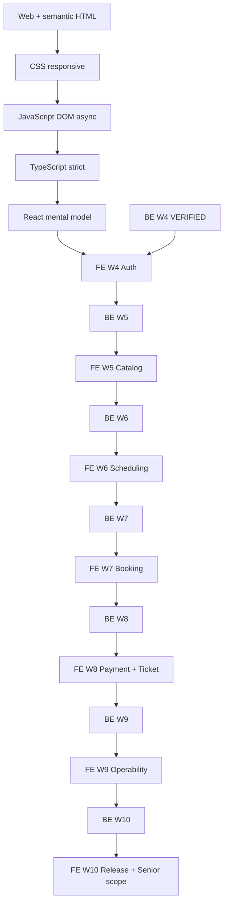

# Frontend dependency graph

Every solid delivery edge is an AND-gate with the declared frontend capability prerequisites. Backend nodes mean verified public capability evidence, never planned or merely completed code.
