# Bản đồ phụ thuộc kiến thức và project — 10 tuần

> Tài liệu này giải thích learning cadence. Canonical behavior nằm tại
> `AI-contracts/19-learning-first-policy.md`, schema gate tại
> `AI-contracts/20-learning-gate-standard.md`, và projection 35 ticket tại
> `AI-contracts/learning/ticket-learning-map-weeks-4-10.md`.

Tài liệu này là quy tắc sắp xếp curriculum trong app-track. Một ngày học chỉ hợp lệ khi đầu ra của ngày trước là đầu vào có thể chỉ ra được của ngày sau.

## Chuỗi xuyên suốt

```mermaid
flowchart LR
  W1["W1 Protocol & HTTP"] --> W2["W2 Type & code boundaries"]
  W2 --> W3["W3 Data, concurrency & production foundation"]
  W3 --> W4["W4 Identity, Gateway & identity_db"]
  W4 --> W5["W5 Movie, Trailer & catalog_db"]
  W5 --> W6["W6 Cinema, Showtime & Catalog events"]
  W6 --> W7["W7 Booking consistency"]
  W7 --> W8["W8 Async, payment & cache"]
  W8 --> W9["W9 Operability & deployment"]
  W9 --> W10["W10 Release & hiring evidence"]
```

## Dependency contract từng tuần

| Tuần | Kiến thức đầu vào | Chuỗi trong tuần | Project/output được phép làm | Gate trước tuần sau |
|---:|---|---|---|---|
| 1 | Không yêu cầu framework | Backend boundary → DNS/TCP/TLS → HTTP semantics → quan sát request/failure → API contract | HTTP/API mini labs, chưa làm project | Giải thích request lifecycle, method/status/header, invariant, error và idempotency |
| 2 | HTTP contract và failure model tuần 1 | Type/runtime boundary → OOP bảo vệ invariant → DI/dependency direction → domain lab → NestJS mental model | Mini domain + NestJS in-memory app | Tách DTO/domain/persistence, dependency có test seam, framework không sở hữu business rule |
| 3 | Boundary, invariant, test seam | Data model/constraint → index/transaction/concurrency → threat/production/microservice theory → PostgreSQL lab → security/reliability gate | DB và production mini labs độc lập | Chứng minh constraint, transaction, race, threat boundary, outbox và observability mental model |
| 4 | Foundation gate tuần 3 | Identity ownership → auth threat model → schema/migration → token/session lifecycle → implementation | Gateway + Identity + `identity_db` auth/profile slice | Clean migration, secure token/session policy, RBAC deny, no secret log và correlation evidence |
| 5 | Trusted actor context tuần 4 | Movie/trailer lifecycle → Catalog schema → query/index proof → public/admin contract → implementation | Movie + Trailer trong Catalog Service | Clean migration, constraints, EXPLAIN, Guest/Admin e2e; chưa tạo showtime |
| 6 | Catalog foundation tuần 5 | Cinema/screen/seat invariants → showtime schedule → outbox/event contract → implementation | Catalog scheduling + showtime events | Additive migration, overlap/seat constraints, atomic state+outbox và consumer fixture |
| 7 | Catalog events + Identity actor context | Booking state machine → local concurrency → idempotency/replay → transaction/event mapping → implementation | Booking/seat hold/ticket/check-in | Exactly-one-winner race test, local transaction, duplicate command/event safety |
| 8 | Booking state/idempotency + outbox foundation | Cache boundary → reliable worker/outbox/inbox/DLQ → payment lifecycle/webhook → ownership/failure map → implementation | Worker, expiry, payment mock/webhook, Catalog cache | Replay/crash recovery, bounded retry/DLQ, signature/idempotency, cache not source of truth |
| 9 | Các service core đã chạy | Signals/correlation → resilience/shutdown → deploy/migration/rollback → release topology → hardening | Compose/CI/health/tracing/runbook | Reproducible deploy, readiness, graceful shutdown, failure smoke và rollback plan |
| 10 | Release candidate tuần 9 | Design review → load/bottleneck evidence → interview synthesis → evidence closure → regression/demo | Capstone release và hiring packet | Clean checkout demo, regression xanh, trade-off explanation, mock interview |

## Quy tắc một tuần project

Mỗi tuần 4–10 tuân theo một template duy nhất:

1. **Thứ 2 — Problem/Foundation:** hiểu business invariant và ownership.
2. **Thứ 3 — Mechanism/Failure:** học cơ chế dữ liệu/runtime và failure modes.
3. **Thứ 4 — Framework/Application:** đọc docs framework/provider, security và production behavior.
4. **Thứ 5 — Design before code:** API/schema/state/sequence/failure matrix và test plan.
5. **Thứ 6–7 — Implementation/Evidence:** chỉ code khi bốn phần trước có artifact.

Nếu topic đặc thù cần thay nhịp, dependency vẫn phải giữ: problem → concept/standard → technology docs → design → code/evidence.

## Core và stretch

- Core: Gateway, Catalog, Identity, Booking, PostgreSQL, outbox/worker, payment mock/webhook safety, cache boundary, observability, CI/deploy.
- Stretch: semantic search/embeddings, provider payment thật, Kubernetes/cloud scaling.
- Stretch không được xuất hiện trong implementation backlog khi core gate của tuần chưa đạt.

## Resource contract trên app-track

Mỗi ngày phải có tối thiểu ba external resources và được hiển thị trực tiếp trên UI theo thứ tự:

1. `NỀN TẢNG`: hiểu problem/domain/mental model.
2. `CHUẨN / ĐẶC TẢ`: RFC, PostgreSQL, OWASP/NIST hoặc standard tương ứng.
3. `FRAMEWORK / THƯ VIỆN`: Node.js, NestJS, TypeORM, Redis, BullMQ, Stripe hoặc provider đang dùng.
4. `NÂNG CAO`: trade-off, scale, failure và production concerns.
5. `THỰC HÀNH`: lab/tutorial liên quan trực tiếp, không dùng link “lấp chỗ trống”.

Một resource có thể có nhiều tag. Ví dụ payment lifecycle là nền tảng business nhưng đồng thời là provider documentation.
