# Kế hoạch triển khai Movie Ticket Booking Backend

> Phiên bản: 1.1
> Ngày cập nhật: 2026-07-28
> Khung thời gian: 7 tuần, từ tuần 4 đến tuần 10  
> Trạng thái tài liệu: `PLANNED` — không phải bằng chứng triển khai  
> Nguồn: trạng thái repository, `CODEX-CONTEXT.md` và `AI-contracts/`

<!-- GENERATED:PLAN-PROGRESS:START -->
## Tiến độ canonical tự động

> Vùng này được sinh từ `AI-contracts/state/current-work.yml`. Dấu ☑ chỉ dành cho ticket có review
> `VERIFIED` và handoff; ◉ là ticket đang được authorize. Không sửa checkbox bằng tay.

- Baseline: `PC-2026.11`
- Ticket hiện tại: `TKT-W04-D05` — stage `HANDOFF`
- Hoàn thành có xác minh: **5/35**
- Next action: `AUTHORIZE_CANDIDATE_TICKET`

| | Ticket | Trạng thái | Ý nghĩa |
|---|---|---|---|
| ☑ | `TKT-W04-D01` | `VERIFIED` | Canonical completed ticket |
| ☑ | `TKT-W04-D02` | `VERIFIED` | Canonical completed ticket |
| ☑ | `TKT-W04-D03` | `VERIFIED` | Canonical completed ticket |
| ☑ | `TKT-W04-D04` | `VERIFIED` | Canonical completed ticket |
| ☑ | `TKT-W04-D05` | `VERIFIED` | Canonical completed ticket |
| ☐ | `TKT-W05-D01` | `CANDIDATE` | Not authorized |
| ☐ | `TKT-W05-D02` | `PLANNED` | Not started |
| ☐ | `TKT-W05-D03` | `PLANNED` | Not started |
| ☐ | `TKT-W05-D04` | `PLANNED` | Not started |
| ☐ | `TKT-W05-D05` | `PLANNED` | Not started |
| ☐ | `TKT-W06-D01` | `PLANNED` | Not started |
| ☐ | `TKT-W06-D02` | `PLANNED` | Not started |
| ☐ | `TKT-W06-D03` | `PLANNED` | Not started |
| ☐ | `TKT-W06-D04` | `PLANNED` | Not started |
| ☐ | `TKT-W06-D05` | `PLANNED` | Not started |
| ☐ | `TKT-W07-D01` | `PLANNED` | Not started |
| ☐ | `TKT-W07-D02` | `PLANNED` | Not started |
| ☐ | `TKT-W07-D03` | `PLANNED` | Not started |
| ☐ | `TKT-W07-D04` | `PLANNED` | Not started |
| ☐ | `TKT-W07-D05` | `PLANNED` | Not started |
| ☐ | `TKT-W08-D01` | `PLANNED` | Not started |
| ☐ | `TKT-W08-D02` | `PLANNED` | Not started |
| ☐ | `TKT-W08-D03` | `PLANNED` | Not started |
| ☐ | `TKT-W08-D04` | `PLANNED` | Not started |
| ☐ | `TKT-W08-D05` | `PLANNED` | Not started |
| ☐ | `TKT-W09-D01` | `PLANNED` | Not started |
| ☐ | `TKT-W09-D02` | `PLANNED` | Not started |
| ☐ | `TKT-W09-D03` | `PLANNED` | Not started |
| ☐ | `TKT-W09-D04` | `PLANNED` | Not started |
| ☐ | `TKT-W09-D05` | `PLANNED` | Not started |
| ☐ | `TKT-W10-D01` | `PLANNED` | Not started |
| ☐ | `TKT-W10-D02` | `PLANNED` | Not started |
| ☐ | `TKT-W10-D03` | `PLANNED` | Not started |
| ☐ | `TKT-W10-D04` | `PLANNED` | Not started |
| ☐ | `TKT-W10-D05` | `PLANNED` | Not started |
<!-- GENERATED:PLAN-PROGRESS:END -->

API inventory có 55 endpoint: 37 `CORE_REQUIRED`, 4 `CORE_OPTIONAL`, 11 `STRETCH`,
3 `POST_MVP`. Contract hóa endpoint không đồng nghĩa cấp quyền triển khai.

## 1. Mục tiêu

Xây dựng Movie Ticket Booking Backend theo kiến trúc microservices, đi từ contract và
Foundation Gate đến một bản release có thể tái hiện từ clean checkout. Hệ thống cuối kỳ
phải chứng minh được:

- Guest tìm thấy movie và showtime đã publish.
- Customer giữ và đặt ghế mà không oversell khi có cạnh tranh đồng thời.
- Payment đi qua provider-neutral port; production adapter là payOS, deterministic fake
  dùng cho local/test; thành công chỉ được ghi nhận sau khi webhook được xác minh.
- Một booking đã thanh toán chỉ phát hành tối đa một ticket.
- Operator truy vết, xử lý retry/DLQ và phục hồi hệ thống bằng evidence quan sát được.

Kế hoạch hoàn thành khi 35 ticket cốt lõi từ tuần 4–10 đã qua weekly gate, mọi
`BLOCKER/HIGH` đã được giải quyết, và release gate có evidence tái hiện được.

## 2. Phạm vi và giới hạn

### Trong phạm vi

- Gateway, Identity Service, Catalog Service, Booking Service và Worker.
- Database và migration riêng cho từng service.
- OpenAPI, event contracts, outbox/inbox, concurrency, observability và vận hành.
- Unit, integration, contract, database, concurrency, E2E và failure-drill tests.
- Evidence manifest, design notes, review records và release handover.

### Ngoài phạm vi

- Loyalty, promotion và refund automation.
- Toàn bộ AI, recommendation, semantic search và preferences (`STRETCH`).
- Staff ticket lookup/check-in (`POST_MVP`).
- Multi-region và real payment settlement.
- Domain mới trong tuần 10.
- Scaffold toàn bộ topology trước khi ticket/gate tương ứng cho phép.

### Ràng buộc bất biến

- Gateway không chứa business logic và không truy cập database của domain service.
- Không shared database, cross-service ORM relation, FK hoặc SQL join.
- Không dùng `synchronize: true`; mọi schema change đi qua immutable migration.
- Không giữ database transaction qua network call.
- Actor context chỉ được tin khi Gateway tạo từ identity đã xác minh.
- Command/event/webhook có thể lặp phải idempotent.
- Không claim `VERIFIED` nếu thiếu command, exit code, artifact và observation thật.

## 3. Snapshot lịch sử khi plan 1.1 được tạo

> Phần này giữ context ban đầu để giải thích quyết định của kế hoạch, không phải trạng
> thái hiện tại. Xem vùng **Tiến độ canonical tự động** ở đầu tài liệu để biết trạng thái
> đang có hiệu lực.

| Hạng mục | Quan sát | Hệ quả |
|---|---|---|
| Source | `mtb.client/` và `mtb.server/` chưa được scaffold | Chưa có entrypoint/runtime để test |
| Git | Branch `main` chưa có commit; toàn bộ file hiện là untracked | Cần baseline có chủ đích sau Foundation Gate |
| Phase | `P0_PROJECT_CONTRACT_AND_FOUNDATION_GATE` | Chưa được mở implementation |
| Gate | `FG-001` chưa có reviewer evidence | Đây là blocker ưu tiên cao nhất |
| Contract baseline | `PC-2026.3`, CCR-005 đã áp dụng | 55/55 endpoint đã map; không phải runtime evidence |
| Operational context | `TKT-W04-D01` là candidate, chưa authorized | Chờ reviewer verdict cho `FG-001` |
| Control-plane state | `ticket_id: null`, stage `FOUNDATION_GATE` | Projection đã đồng bộ; không có application ticket |
| Next action | `state/next-action.yml` yêu cầu lấy evidence cho `FG-001` | Phải xử lý gate trước mọi scaffold |
| Test/evidence | Chưa có migration, test hoặc runtime evidence | Mọi trạng thái tiến độ mặc định là chưa thực hiện |

## 4. Phương án và quyết định

### Phương án A — Scaffold toàn bộ hệ thống ngay

- Ưu điểm: nhìn thấy cấu trúc dự án sớm.
- Nhược điểm: vi phạm Foundation Gate và topology-on-demand; tạo nhiều code chưa có
  contract, tăng rework và làm mờ ownership.

### Phương án B — Thiết kế toàn bộ 7 tuần rồi mới code

- Ưu điểm: có bức tranh lớn đầy đủ.
- Nhược điểm: feedback quá muộn; design xa implementation dễ lỗi thời.

### Phương án C — Contract-gated vertical slices

- Mỗi ngày giải quyết một ticket nhỏ.
- Design/contract được review trước code.
- Mỗi tuần kết thúc bằng một vertical slice chạy được và một weekly gate.
- Phase sau chỉ mở khi dependency trước đã `VERIFIED`.

**Quyết định:** chọn phương án C. Đây là phương án phù hợp với policy hiện có, giảm
rework và tạo evidence theo từng capability thay vì dồn rủi ro về cuối.

## 5. Sơ đồ phụ thuộc

```mermaid
flowchart LR
    FG["FG-001<br/>Foundation evidence"] --> P0["P0 · Contract baseline"]
    P0 --> P1["P1 · Identity & security"]
    P1 --> P2["P2 · Catalog & scheduling"]
    P2 --> P3["P3 · Reliable events"]
    P3 --> P4["P4 · Booking & concurrency"]
    P4 --> P5["P5 · Payment, ticket & worker"]
    P5 --> P6["P6 · Observability & operations"]
    P6 --> P7["P7 · Release & handover"]
```



## 6. Chu kỳ chuẩn của một ticket

Mọi ticket đi qua cùng một flow và không được bỏ qua gate:

1. **Analyze & Clarify:** xác nhận actor, outcome, scope, invariant, dependency,
   failure/security case và unanswered questions.
2. **Design & Contract:** viết design note, API/data/event delta, rejected
   alternative, test matrix, migration/compatibility/rollback.
3. **DoR review:** chỉ chuyển sang implementation khi `DOR-001..008` đạt.
4. **Implement & Self-review:** diff nhỏ, đúng owner, có migration/test/telemetry cần thiết.
5. **Verify:** ghi prediction trước command; lưu command, working directory, exit code,
   artifact và observation; chạy happy path cùng ít nhất một negative/failure case.
6. **Review:** đánh giá scope, contract, invariant, security, data ownership và evidence.
7. **Close:** chỉ đánh dấu `VERIFIED` khi mọi AC có evidence và `BLOCKER/HIGH = 0`.

## 7. Master plan tuần 4–10

### Tuần 4 — Contract baseline, Identity và Security

**Mục tiêu tuần:** Foundation Gate được xác minh và vertical slice
register/login/refresh/logout/me chạy qua Gateway.

| Ngày | Ticket | Outcome và task chính | Evidence bắt buộc |
|---|---|---|---|
| 1 | `TKT-W04-D01` | Audit Foundation Gate; freeze MVP/out-of-scope; map actor, owner và trust boundary; reconcile state drift | Gate review, contract review note, evidence manifest |
| 2 | `TKT-W04-D02` | Thiết kế user/role/session, refresh-token hash, migration và seed | ERD, clean/upgrade plan, constraint test matrix |
| 3 | `TKT-W04-D03` | Thiết kế token lifecycle, rotation/reuse detection, Gateway auth pipeline và redaction | State/sequence diagram, threat matrix, 401/403 policy |
| 4 | `TKT-W04-D04` | Review OpenAPI auth, error envelope, idempotency và RBAC deny cases | OpenAPI, contract test plan, review verdict |
| 5 | `TKT-W04-D05` | Implement vertical slice Identity qua Gateway | Migration output, API/deny/replay tests, correlated trace |

**Weekly Gate W4**

- Tất cả ticket W4 `VERIFIED`.
- Register/login/refresh/logout/me đúng OpenAPI.
- Refresh replay bị từ chối và token family được xử lý theo contract.
- Không log credential/token; clean migration và seed tái hiện được.

### Tuần 5 — Movie và Trailer Catalog

**Mục tiêu tuần:** Guest/Admin dùng được movie/trailer lifecycle với query ổn định,
bounded và đúng authorization.

| Ngày | Ticket | Outcome và task chính | Evidence bắt buộc |
|---|---|---|---|
| 1 | `TKT-W05-D01` | Chốt lifecycle movie/trailer, DTO public/admin và ownership | State diagram, owner map, rejected alternative |
| 2 | `TKT-W05-D02` | Thiết kế schema, constraints, immutable migration và idempotent seed | ERD, clean/upgrade output, constraint cases |
| 3 | `TKT-W05-D03` | Thiết kế filter/sort/page allowlist, stable ordering và index | Query note, EXPLAIN baseline, index rationale |
| 4 | `TKT-W05-D04` | Review OpenAPI, trusted actor context, error/deny matrix | Contract review, 401/403/404 cases |
| 5 | `TKT-W05-D05` | Implement movie/trailer vertical slice | Public/admin E2E, migration, query plan, auth negatives |

**Weekly Gate W5:** public chỉ thấy resource hợp lệ; Admin lifecycle đúng invariant;
query bounded/stable; constraint và authorization negatives đều có evidence.

### Tuần 6 — Cinema, Screen, Seat, Showtime và Reliable Publish

**Mục tiêu tuần:** Admin publish lịch chiếu hợp lệ; Booking có thể nhận showtime fact
được version hóa và phát hành tin cậy.

| Ngày | Ticket | Outcome và task chính | Evidence bắt buộc |
|---|---|---|---|
| 1 | `TKT-W06-D01` | Chốt owner, lifecycle và overlap policy cho scheduling | ERD, state machine, overlap ADR |
| 2 | `TKT-W06-D02` | Thiết kế additive migration, uniqueness/overlap constraints và indexes | Clean + W5 upgrade, negative DB tests |
| 3 | `TKT-W06-D03` | Chốt event envelope, outbox/inbox, ordering, retry và DLQ | AsyncAPI/schema, fixtures, failure matrix |
| 4 | `TKT-W06-D04` | Review API/event sequence và state+outbox atomicity | OpenAPI, sequence, atomicity test matrix |
| 5 | `TKT-W06-D05` | Implement scheduling API và outbox publisher slice | Constraint/API tests, atomic DB evidence, event fixture |

**Weekly Gate W6:** seat label unique, showtime không overlap, invalid publish bị chặn,
state/outbox atomic và event fixture tương thích với consumer.

### Tuần 7 — Booking và Concurrency

**Mục tiêu tuần:** hai customer tranh cùng ghế chỉ có đúng một người thắng; hold hết
hạn và duplicate/replay không phá invariant.

| Ngày | Ticket | Outcome và task chính | Evidence bắt buộc |
|---|---|---|---|
| 1 | `TKT-W07-D01` | Thiết kế snapshot, hold/booking state, expiry và resource ownership | ERD, state/sequence, ownership policy |
| 2 | `TKT-W07-D02` | Chọn transaction/isolation/lock/constraint và deadlock retry | ADR, race timeline, real-DB test plan |
| 3 | `TKT-W07-D03` | Thiết kế inbox/dedup, command idempotency và unknown outcome | Schema, replay fixtures, crash-window analysis |
| 4 | `TKT-W07-D04` | Review consume→hold→confirm API/event sequence | OpenAPI, failure/security matrix |
| 5 | `TKT-W07-D05` | Implement snapshot consumer, hold, confirm và expiry | Synchronized contenders, final DB state, replay/E2E |

**Weekly Gate W7:** exactly one winner trong race thật; expired hold không confirm;
cross-user access bị từ chối; duplicate event/command không lặp business effect.

### Tuần 8 — Payment, Ticket và Worker

**Mục tiêu tuần:** payment webhook được xác minh, booking chuyển trạng thái hợp lệ,
ticket phát hành tối đa một lần và worker phục hồi failure có kiểm soát.

| Ngày | Ticket | Outcome và task chính | Evidence bắt buộc |
|---|---|---|---|
| 1 | `TKT-W08-D01` | Chốt payment/booking/ticket state và reconciliation policy | State table, mismatch policy, invariant proof |
| 2 | `TKT-W08-D02` | Thiết kế worker ACK/effect windows, retry/backoff/DLQ và operator replay | Sequence, crash matrix, runbook |
| 3 | `TKT-W08-D03` | Thiết kế raw-body signature, amount/currency/reference verification | Threat matrix, fixtures, redaction tests |
| 4 | `TKT-W08-D04` | Review provider port/adapter, timeout và unknown outcome | OpenAPI, failure matrix, compatibility plan |
| 5 | `TKT-W08-D05` | Implement mock payment, webhook, ticket và expiry worker slice | E2E, duplicate/crash replay, DLQ và log evidence |

**Weekly Gate W8:** invalid signature/mismatch không tạo business effect; duplicate
webhook không phát hành thêm ticket; retry bounded; operator quan sát và replay được.

### Tuần 9 — Observability, Resilience và Operations

**Mục tiêu tuần:** operator chẩn đoán request/event xuyên service, hệ thống degrade và
shutdown có giới hạn, database phục hồi được.

| Ngày | Ticket | Outcome và task chính | Evidence bắt buộc |
|---|---|---|---|
| 1 | `TKT-W09-D01` | Baseline ba core query, chọn index theo workload | Dataset, before/after EXPLAIN, cost analysis |
| 2 | `TKT-W09-D02` | Thiết kế correlation/trace, bounded metrics và redaction | Cross-service trace, redaction/cardinality tests |
| 3 | `TKT-W09-D03` | Thiết kế timeout/retry budget, readiness, pool và graceful drain | Dependency-failure timeline, smoke output |
| 4 | `TKT-W09-D04` | Thiết kế backup/restore, deploy/migration rollback, CI và runbook | Reviewed runbook, restore criteria, CI gates |
| 5 | `TKT-W09-D05` | Implement telemetry/health/shutdown/index và chạy failure drills | Query plans, trace, dependency smoke, restore output |

**Weekly Gate W9:** trace xuyên Gateway→service→event; log không leak; readiness đổi
đúng khi dependency chết; shutdown không nhận việc mới; restore được xác minh.

### Tuần 10 — Release, Audit và Handover

**Mục tiêu tuần:** feature freeze; reviewer tái hiện hệ thống và learner bảo vệ được
invariant, quyết định và trade-off.

| Ngày | Ticket | Outcome và task chính | Evidence bắt buộc |
|---|---|---|---|
| 1 | `TKT-W10-D01` | Audit ownership, API/event/schema drift; tạo finding thay vì feature mới | Traceability matrix, audit findings |
| 2 | `TKT-W10-D02` | Chạy load/race/replay/failure regression và chỉ sửa blocker | Workload model, p50/p95/error, invariant checks |
| 3 | `TKT-W10-D03` | Security/data/ops audit, clean/upgrade/restore regression | Scan/manual audit, migration/restore evidence |
| 4 | `TKT-W10-D04` | Hoàn thiện README, diagrams, ADR, demo và evidence index | Newcomer dry-run, reviewed handover |
| 5 | `TKT-W10-D05` | Clean checkout→install→migrate→seed→run→test→demo và defense | Full command log, E2E/race/replay/failure, verdict |

**Release Gate:** unresolved critical/high bằng 0; clean checkout tái hiện được; core
invariants giữ nguyên dưới load/race/replay/failure; learner giải thích ít nhất năm
trade-off; reviewer đưa ra release verdict.

## 8. Kế hoạch hành động chi tiết — `TKT-W04-D01`

### Mục tiêu và điều kiện hoàn thành

Tạo contract baseline không mâu thuẫn và chứng minh Foundation Gate đủ điều kiện trước
khi scaffold. Ticket chỉ hoàn thành khi:

- `FG-001` có reviewer verdict và references quan sát được.
- Actor, MVP, out-of-scope, service/data owner và trust boundary thống nhất.
- Unanswered conflict bằng 0, hoặc ticket giữ `BLOCKED` với lý do và owner rõ.
- `CODEX-CONTEXT.md`, `state/current-ticket.yml` và `state/next-action.yml` không còn
  drift về ticket/status.

### Task breakdown

| ID | Task có thể thực hiện | Đầu vào | Đầu ra / Acceptance |
|---|---|---|---|
| D01-01 | Lập inventory evidence tuần 1–3 | Foundation artifacts do learner/reviewer cung cấp | Danh sách artifact, nguồn, hash/path, trạng thái quan sát |
| D01-02 | Kiểm tính hợp lệ evidence | Inventory và evidence policy | Không có claim dựa trên lời kể/checkbox; missing item được ghi rõ |
| D01-03 | Chạy Foundation Gate review | Gate template, capability checklist | Verdict `VERIFIED`, `CONDITIONAL_PASS`, `CHANGES_REQUIRED` hoặc `BLOCKED` |
| D01-04 | Audit product scope | Product contract và roadmap | Actor/outcome/MVP/out-of-scope không mâu thuẫn |
| D01-05 | Audit architecture ownership | Architecture/data/event contracts | Owner matrix cho Gateway/Identity/Catalog/Booking/Worker |
| D01-06 | Audit trust boundaries | Security contract | Nguồn identity, secrets, webhook, service identity và deny policy rõ |
| D01-07 | Ghi conflict/questions | Kết quả D01-04..06 | Mỗi conflict có owner, decision deadline và blocking impact |
| D01-08 | Reconcile control-plane state | Context + ba file `state/*.yml` liên quan | Cùng ticket, gate, blocker và next action; không tự nâng status |
| D01-09 | Lập evidence manifest | Tất cả output trên | AC→artifact→command→observation traceable |
| D01-10 | Independent review và close | Review note + manifest | `BLOCKER/HIGH = 0`; AC được map; next ticket chỉ mở khi `VERIFIED` |

### Trình tự thực hiện đề xuất

1. Yêu cầu hoặc định vị evidence Foundation tuần 1–3; không có evidence thì dừng ở
   `BLOCKED`, không scaffold.
2. Kiểm evidence theo `EVD-001` và policy repository; phân biệt `OBSERVED`,
   `REPORTED`, `MISSING`.
3. Dùng `AI-contracts/templates/weekly-gate.md` thực hiện reviewer gate.
4. Nếu gate không `VERIFIED`, tạo remediation nhỏ nhất cho finding quan trọng nhất.
5. Nếu gate `VERIFIED`, audit product/architecture/security và lập owner/trust matrix.
6. Resolve từng conflict bằng explicit decision hoặc giữ ticket blocked.
7. Reconcile state files bằng evidence; không dùng `DONE` thay cho `VERIFIED`.
8. Tạo review note và evidence manifest, map toàn bộ acceptance criteria.
9. Reviewer độc lập kiểm tra; chỉ sau verdict hợp lệ mới mở `TKT-W04-D02`.

### Verification matrix

| Acceptance criterion | Positive check | Negative/failure check | Evidence |
|---|---|---|---|
| Foundation Gate có verdict | Reviewer đọc được artifact và đưa verdict | Missing/unreadable/reference giả phải bị từ chối | Gate review + evidence index |
| Scope/owner/trust không mâu thuẫn | Mỗi actor/data/call có owner rõ | Shared DB, Gateway business logic hoặc untrusted actor header bị phát hiện | Contract review note |
| Unanswered conflict = 0 hoặc blocked rõ | Decision log map từng conflict | Conflict không owner/decision không được coi là resolved | Conflict register |
| State được reconcile | Context và control-plane cùng ticket/status | Không tự đổi `VERIFIED` khi thiếu evidence | Git diff + state validation |

### Definition of Ready cho ticket kế tiếp

Chỉ mở `TKT-W04-D02` khi:

- `TKT-W04-D01` và `FG-001` đều `VERIFIED`.
- Evidence manifest có thể truy vết và reviewer đã quan sát.
- Không còn `BLOCKER/HIGH`.
- Contract IDs dùng cho Identity tồn tại và không mâu thuẫn.

## 9. Chiến lược test toàn dự án

| Tầng | Mục tiêu | Ví dụ bắt buộc |
|---|---|---|
| Static | Format, lint, type và contract/schema validation | OpenAPI/AsyncAPI schema validation |
| Unit | State transition, policy và pure domain logic | token reuse, publish transition, expiry policy |
| Integration | Service boundary và database thật | migration, unique/overlap constraints, repository |
| Contract | Provider/consumer compatibility | Gateway↔service API, Catalog→Booking event fixture |
| Security | Authentication, authorization, redaction | 401/403, spoof header, invalid webhook signature |
| Concurrency | Invariant dưới race | two synchronized holds, duplicate webhook/event |
| E2E | Core business outcome | browse→hold→book→pay→ticket |
| Operations | Failure và recovery | dependency down, DLQ replay, graceful shutdown, restore |
| Release | Reproducibility | clean checkout→install→migrate→seed→run→test |

## 10. Risk matrix và biện pháp

| Rủi ro | Xác suất | Tác động | Kiểm soát / Trigger |
|---|---:|---:|---|
| Scaffold trước gate | Cao | Cao | Block implementation cho tới `FG-001 VERIFIED` |
| Drift giữa context và state files | Cao | Cao | Reconcile trong D01; validate trước mỗi session |
| Oversell do race | Trung bình | Rất cao | DB invariant + synchronized real-DB concurrency test |
| Duplicate event/webhook | Cao | Rất cao | Outbox/inbox, idempotency key, eventId dedup |
| Migration làm mất dữ liệu | Trung bình | Rất cao | Immutable expand/contract, clean+upgrade+restore evidence |
| Token/PII leak | Trung bình | Rất cao | Redaction allowlist, security tests, log review |
| Distributed transaction ngầm | Trung bình | Cao | Local transaction + outbox; không network trong DB txn |
| Retry storm/DLQ không kiểm soát | Trung bình | Cao | Bounded backoff+jitter, poison routing, operator runbook |
| Test pass giả do mock | Trung bình | Cao | Real DB/broker boundary cho concurrency và event tests |
| Dồn evidence cuối kỳ | Cao | Cao | Manifest cập nhật mỗi ticket/weekly gate |
| Scope creep tuần 10 | Trung bình | Cao | Feature freeze; chỉ remediation blocker |

## 11. Evidence và quản trị tiến độ

Mỗi ticket duy trì:

- Design note và decision/rejected alternative.
- Contract delta hoặc xác nhận không có delta.
- Test matrix map với acceptance criteria.
- Evidence manifest gồm prediction, exact command, working directory, exit code,
  artifact path và observation.
- Git diff/self-review và reviewer verdict.
- Một next best action duy nhất.

Trạng thái sử dụng:

```text
Execution: NOT_STARTED → IN_PROGRESS → SUBMITTED
Review:    NOT_REVIEWED → CHANGES_REQUIRED | CONDITIONAL_PASS | VERIFIED | BLOCKED
Evidence:  MISSING → PARTIAL → SUBMITTED → OBSERVED | REJECTED
```

Không suy diễn `VERIFIED` từ checkbox, file tồn tại, `DONE`, command thiếu completed
output hoặc kết quả do người dùng kể lại.

## 12. Mốc kiểm soát

| Mốc | Exit outcome |
|---|---|
| M0 | Contract baseline và Foundation Gate được xác minh |
| M1 | Identity/security vertical slice đúng contract |
| M2 | Movie/trailer catalog đúng lifecycle và query policy |
| M3 | Scheduling hợp lệ và publish event tin cậy |
| M4 | Booking không oversell dưới race/replay |
| M5 | Payment verified, ticket exactly-once, worker phục hồi được |
| M6 | Hệ thống quan sát, degrade, shutdown và restore được |
| M7 | Release tái hiện được và handover hoàn chỉnh |

## 13. Next best action

**Thu thập reviewer evidence tuần 1–3 cho `FG-001`, lập inventory có nguồn tham chiếu,
sau đó thực hiện Foundation Gate review.** Nếu evidence chưa tồn tại hoặc không quan sát
được, giữ `TKT-W04-D01` ở trạng thái `BLOCKED`; không scaffold project.
