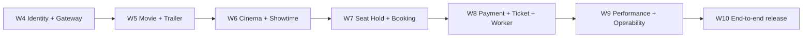

# Kế hoạch delivery tăng trưởng tuần 4–10

> Canonical phase, milestone, dependency và daily contract ticket hiện nằm trong [`AI-contracts/roadmap/`](../AI-contracts/roadmap/). Tài liệu này giữ progression kỹ thuật và database gates hiện có; khi mâu thuẫn về scope/status/review, áp dụng [`AI-contracts/02-source-of-truth.md`](../AI-contracts/02-source-of-truth.md).

Tài liệu này là nguồn chuẩn để sắp thứ tự implementation, backlog và database cho project **Movie Ticket Booking Microservices**. Mỗi tuần chỉ mở rộng 1–2 module nghiệp vụ, phải chạy được từ Gateway và phải sử dụng đầu ra của tuần trước.

## Chuỗi giá trị xuyên suốt

## Delivery contract

| Tuần | Module chạy được | Database thay đổi | Quan hệ bắt buộc | Gate |
|---:|---|---|---|---|
| 4 | Auth, profile và Gateway request pipeline | Khởi tạo `identity_db`: `users`, `roles`, `user_roles`, `refresh_sessions` | Actor context làm nền cho API protected | Register/login/refresh/logout/me chạy qua Gateway; migration clean DB; deny test |
| 5 | Movie và Movie Trailer | Khởi tạo `catalog_db`: `movies`, `movie_trailers` | Admin tuần 4 quản lý catalog; Guest đọc public catalog | CRUD/publish trailer, pagination, constraints, seed và EXPLAIN |
| 6 | Cinema/Screen/Seat và Showtime | Mở rộng `catalog_db`: `cinemas`, `screens`, `seats`, `showtimes`, `outbox_events` | Showtime nối movie với screen; publish event cho Booking | Không trùng ghế/lịch chiếu; event versioned ghi cùng transaction |
| 7 | Seat Hold và Booking | Khởi tạo `booking_db`: snapshot, seats, holds, bookings, inbox/outbox, idempotency | Consume showtime event tuần 6; gắn booking với `actorId` tuần 4 | Exactly-one-winner race test; duplicate event/command an toàn |
| 8 | Payment, Ticket và Worker | Mở rộng `booking_db`: `payments`, `payment_webhook_events`, `tickets`, integration logs | Payment xác nhận booking; booking phát hành ticket | Webhook idempotent, expiry/retry/DLQ, ticket không trùng |
| 9 | Cache/search cơ bản, observability và resilience | Chỉ thêm index/log/retention migration có bằng chứng | Harden toàn bộ flow tuần 4–8 | Trace xuyên service, health/readiness, EXPLAIN, failure smoke, backup/restore |
| 10 | Capstone end-to-end | Migration additive/fix đã review; không mở domain mới | Demo toàn chuỗi từ admin tới customer ticket | Clean checkout, migrate/seed/test/demo bằng lệnh documented |

## Quy tắc module và service

- Module nghiệp vụ không đồng nghĩa với microservice. Movie, trailer, cinema và showtime cùng thuộc Catalog Service.
- Gateway không có business database và không import entity/repository của service khác.
- Identity, Catalog và Booking sở hữu database/credential/migration riêng; không cross-service foreign key, ORM relation hoặc SQL join.
- Cross-service reference là UUID không có foreign key, hoặc snapshot tối thiểu nhận qua event/API.
- Một invariant chỉ có một owner và được bảo vệ trong một local transaction.
- Mỗi thay đổi state cần phát event phải ghi state và outbox trong cùng transaction; consumer dùng inbox/dedup cho at-least-once delivery.

## Quy tắc migration tăng trưởng

1. Không sửa migration đã áp dụng; mỗi tuần thêm migration mới.
2. Tên migration chứa service và capability, ví dụ `identity/001_create_users_roles` hoặc `catalog/002_create_cinemas_showtimes`.
3. Mỗi migration được test trên database rỗng và database của tuần trước.
4. Seed idempotent và chỉ chứa dữ liệu demo tối thiểu của capability hiện có.
5. Không tạo trước bảng của tuần sau.
6. Schema change ưu tiên additive; destructive change cần expand/migrate/contract và rollback plan.

## Definition of Done mỗi tuần

- Boundary, owner, invariant, API/event và non-goal được ghi trước khi code.
- Compose khởi động các thành phần trong scope; liveness/readiness độc lập.
- Migration + seed chạy lại được; constraint và index có lý do từ query/invariant.
- Unit, integration, e2e và failure test tương xứng với rủi ro.
- Có curl/OpenAPI, log/trace, test output và decision note; screenshot đơn lẻ không tính là evidence.
- Backlog của tuần sau chỉ được mở khi gate hiện tại đạt.

## Tài liệu tham khảo ngoài

- [Backend Developer Roadmap](https://roadmap.sh/backend): dùng để kiểm tra độ phủ API, auth, database, cache, security, testing và deployment.
- [PostgreSQL DBA Roadmap](https://roadmap.sh/postgresql-dba): chọn phần phục vụ developer gồm schema, query plan, index, transaction/lock, connection, backup/restore và monitoring; không biến khóa học thành lộ trình DBA đầy đủ.
